# The modelsum function

## Introduction

Very often we are asked to summarize model results from multiple fits
into a nice table. The endpoint might be of different types (e.g.,
survival, case/control, continuous) and there may be several independent
variables that we want to examine univariately or adjusted for certain
variables such as age and sex. Locally at Mayo, the SAS macros
`%modelsum`, `%glmuniv`, and `%logisuni` were written to create such
summary tables. With the increasing interest in R, we have developed the
function `modelsum` to create similar tables within the R environment.

In developing the `modelsum` function, the goal was to bring the best
features of these macros into an R function. However, the task was not
simply to duplicate all the functionality, but rather to make use of R’s
strengths (modeling, method dispersion, flexibility in function
definition and output format) and make a tool that fits the needs of R
users. Additionally, the results needed to fit within the general
reproducible research framework so the tables could be displayed within
an R markdown report.

This report provides step-by-step directions for using the functions
associated with `modelsum`. All functions presented here are available
within the `arsenal` package. An assumption is made that users are
somewhat familiar with R markdown documents. For those who are new to
the topic, a good initial resource is available at
[rmarkdown.rstudio.com](https://rmarkdown.rstudio.com/).

## Simple Example

The first step when using the `modelsum` function is to load the
`arsenal` package. All the examples in this report use a dataset called
`mockstudy` made available by Paul Novotny which includes a variety of
types of variables (character, numeric, factor, ordered factor,
survival) to use as examples.

``` r
> require(arsenal)
Loading required package: arsenal
> data(mockstudy) # load data
> dim(mockstudy)  # look at how many subjects and variables are in the dataset 
[1] 1499   14
> # help(mockstudy) # learn more about the dataset and variables
> str(mockstudy) # quick look at the data
'data.frame':   1499 obs. of  14 variables:
 $ case       : int  110754 99706 105271 105001 112263 86205 99508 90158 88989 90515 ...
 $ age        : int  67 74 50 71 69 56 50 57 51 63 ...
  ..- attr(*, "label")= chr "Age in Years"
 $ arm        : chr  "F: FOLFOX" "A: IFL" "A: IFL" "G: IROX" ...
  ..- attr(*, "label")= chr "Treatment Arm"
 $ sex        : Factor w/ 2 levels "Male","Female": 1 2 2 2 2 1 1 1 2 1 ...
 $ race       : chr  "Caucasian" "Caucasian" "Caucasian" "Caucasian" ...
  ..- attr(*, "label")= chr "Race"
 $ fu.time    : int  922 270 175 128 233 120 369 421 387 363 ...
 $ fu.stat    : int  2 2 2 2 2 2 2 2 2 2 ...
 $ ps         : int  0 1 1 1 0 0 0 0 1 1 ...
 $ hgb        : num  11.5 10.7 11.1 12.6 13 10.2 13.3 12.1 13.8 12.1 ...
 $ bmi        : num  25.1 19.5 NA 29.4 26.4 ...
  ..- attr(*, "label")= chr "Body Mass Index (kg/m^2)"
 $ alk.phos   : int  160 290 700 771 350 569 162 152 231 492 ...
 $ ast        : int  35 52 100 68 35 27 16 12 25 18 ...
 $ mdquality.s: int  NA 1 1 1 NA 1 1 1 1 1 ...
 $ age.ord    : Ord.factor w/ 8 levels "10-19"<"20-29"<..: 6 7 4 7 6 5 4 5 5 6 ...
```

To create a simple linear regression table (the default), use a formula
statement to specify the variables that you want summarized. The example
below predicts BMI with the variables sex and age.

``` r
> tab1 <- modelsum(bmi ~ sex + age, data=mockstudy)
```

If you want to take a quick look at the table, you can use `summary` on
your modelsum object and the table will print out as text in your R
console window. If you use `summary` without any options you will see a
number of $`\&nbsp;`$ statements which translates to “space” in HTML.

### Pretty text version of table

If you want a nicer version in your console window then adding the
`text=TRUE` option.

``` r
> summary(tab1, text=TRUE)


|             |estimate |std.error |p.value |adj.r.squared |Nmiss |
|:------------|:--------|:---------|:-------|:-------------|:-----|
|(Intercept)  |27.491   |0.181     |< 0.001 |0.004         |33    |
|sex Female   |-0.731   |0.290     |0.012   |              |      |
|(Intercept)  |26.424   |0.752     |< 0.001 |0.000         |33    |
|Age in Years |0.013    |0.012     |0.290   |              |      |
```

### Pretty Rmarkdown version of table

In order for the report to look nice within an R markdown (knitr)
report, you just need to specify `results="asis"` when creating the r
chunk. This changes the layout slightly (compresses it) and bolds the
variable names.

``` r
> summary(tab1)
```

|                  | estimate | std.error | p.value  | adj.r.squared | Nmiss |
|:-----------------|:---------|:----------|:---------|:--------------|:------|
| (Intercept)      | 27.491   | 0.181     | \< 0.001 | 0.004         | 33    |
| **sex Female**   | -0.731   | 0.290     | 0.012    |               |       |
| (Intercept)      | 26.424   | 0.752     | \< 0.001 | 0.000         | 33    |
| **Age in Years** | 0.013    | 0.012     | 0.290    |               |       |

### Data frame version of table

If you want a data.frame version, simply use `as.data.frame`.

``` r
> as.data.frame(tab1)
  y.term                  y.label strata.term adjustment model        term
1    bmi Body Mass Index (kg/m^2)             unadjusted     1 (Intercept)
2    bmi Body Mass Index (kg/m^2)             unadjusted     1   sexFemale
3    bmi Body Mass Index (kg/m^2)             unadjusted     2 (Intercept)
4    bmi Body Mass Index (kg/m^2)             unadjusted     2         age
         label term.type    estimate  std.error       p.value adj.r.squared
1  (Intercept) Intercept 27.49147713 0.18134740  0.000000e+00  3.632258e-03
2   sex Female      Term -0.73105055 0.29032223  1.190605e-02  3.632258e-03
3  (Intercept) Intercept 26.42372272 0.75211474 1.279109e-196  8.354809e-05
4 Age in Years      Term  0.01304859 0.01231653  2.895753e-01  8.354809e-05
  Nmiss
1    33
2    33
3    33
4    33
```

### Add an adjustor to the model

The argument `adjust` allows the user to indicate that all the variables
should be adjusted for these terms. To adjust each model for age and sex
(for instance), we use `adjust = ~ age + sex`:

``` r
> tab2 <- modelsum(alk.phos ~ arm + ps + hgb, adjust= ~age + sex, data=mockstudy)
> summary(tab2)
```

|                             | estimate | std.error | p.value  | adj.r.squared | Nmiss |
|:----------------------------|:---------|:----------|:---------|:--------------|:------|
| (Intercept)                 | 175.548  | 20.587    | \< 0.001 | -0.001        | 266   |
| **Treatment Arm F: FOLFOX** | -13.701  | 8.730     | 0.117    |               |       |
| **Treatment Arm G: IROX**   | -2.245   | 9.860     | 0.820    |               |       |
| **Age in Years**            | -0.017   | 0.319     | 0.956    |               |       |
| **sex Female**              | 3.016    | 7.521     | 0.688    |               |       |
| (Intercept)                 | 148.391  | 19.585    | \< 0.001 | 0.045         | 266   |
| **ps**                      | 46.721   | 5.987     | \< 0.001 |               |       |
| **Age in Years**            | -0.084   | 0.311     | 0.787    |               |       |
| **sex Female**              | 1.169    | 7.343     | 0.874    |               |       |
| (Intercept)                 | 336.554  | 32.239    | \< 0.001 | 0.031         | 266   |
| **hgb**                     | -13.845  | 2.137     | \< 0.001 |               |       |
| **Age in Years**            | 0.095    | 0.314     | 0.763    |               |       |
| **sex Female**              | -5.980   | 7.516     | 0.426    |               |       |

## Models for each endpoint type

To make sure the correct model is run you need to specify “family”. The
options available right now are : gaussian, binomial, survival, and
poisson. If there is enough interest, additional models can be added.

### Gaussian

#### Fit and summarize linear regression model

Look at whether there is any evidence that AlkPhos values vary by study
arm after adjusting for sex and age (assuming a linear age
relationship).

``` r
> fit <- lm(alk.phos ~ arm + age + sex, data=mockstudy)
> summary(fit)

Call:
lm(formula = alk.phos ~ arm + age + sex, data = mockstudy)

Residuals:
    Min      1Q  Median      3Q     Max 
-168.80  -81.45  -47.17   37.39  853.56 

Coefficients:
              Estimate Std. Error t value Pr(>|t|)    
(Intercept)  175.54808   20.58665   8.527   <2e-16 ***
armF: FOLFOX -13.70062    8.72963  -1.569    0.117    
armG: IROX    -2.24498    9.86004  -0.228    0.820    
age           -0.01741    0.31878  -0.055    0.956    
sexFemale      3.01598    7.52097   0.401    0.688    
---
Signif. codes:  0 '***' 0.001 '**' 0.01 '*' 0.05 '.' 0.1 ' ' 1

Residual standard error: 128.5 on 1228 degrees of freedom
  (266 observations deleted due to missingness)
Multiple R-squared:  0.002552,  Adjusted R-squared:  -0.0006969 
F-statistic: 0.7855 on 4 and 1228 DF,  p-value: 0.5346
> plot(fit)
```

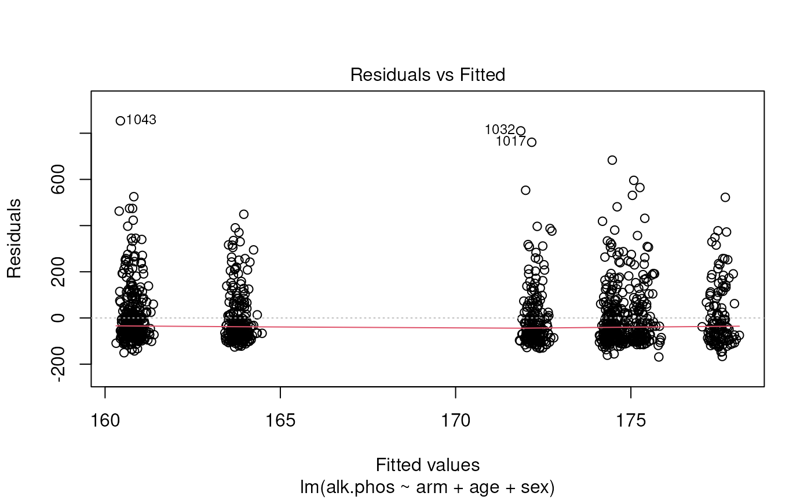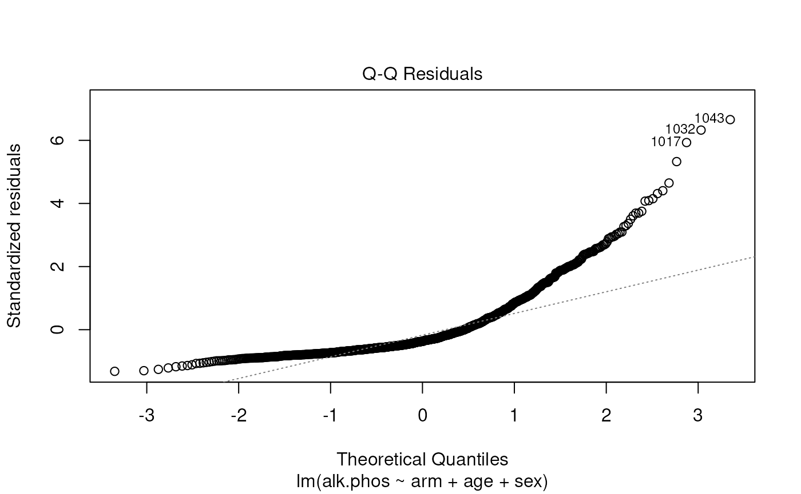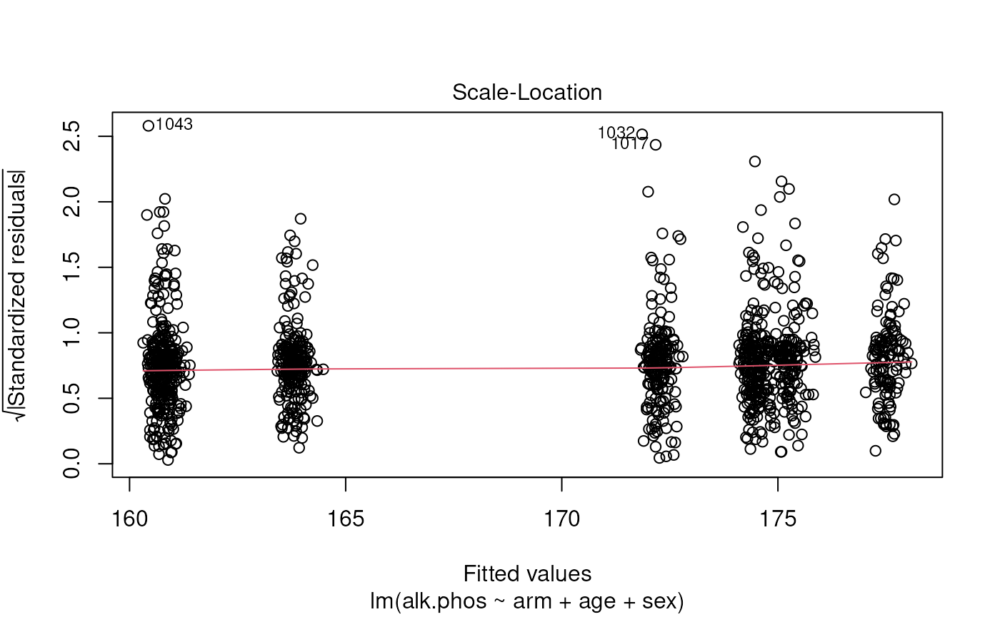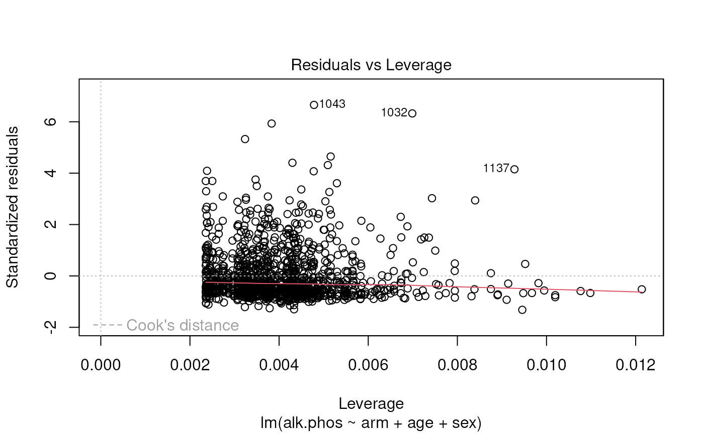

The results suggest that the endpoint may need to be transformed.
Calculating the Box-Cox transformation suggests a log transformation.

``` r
> require(MASS)
> boxcox(fit)
```


``` r
> fit2 <- lm(log(alk.phos) ~ arm + age + sex, data=mockstudy)
> summary(fit2)

Call:
lm(formula = log(alk.phos) ~ arm + age + sex, data = mockstudy)

Residuals:
    Min      1Q  Median      3Q     Max 
-3.0098 -0.4470 -0.1065  0.4205  2.0620 

Coefficients:
               Estimate Std. Error t value Pr(>|t|)    
(Intercept)   4.9692474  0.1025239  48.469   <2e-16 ***
armF: FOLFOX -0.0766798  0.0434746  -1.764    0.078 .  
armG: IROX   -0.0192828  0.0491041  -0.393    0.695    
age          -0.0004058  0.0015876  -0.256    0.798    
sexFemale     0.0179253  0.0374553   0.479    0.632    
---
Signif. codes:  0 '***' 0.001 '**' 0.01 '*' 0.05 '.' 0.1 ' ' 1

Residual standard error: 0.6401 on 1228 degrees of freedom
  (266 observations deleted due to missingness)
Multiple R-squared:  0.003121,  Adjusted R-squared:  -0.0001258 
F-statistic: 0.9613 on 4 and 1228 DF,  p-value: 0.4278
> plot(fit2)
```

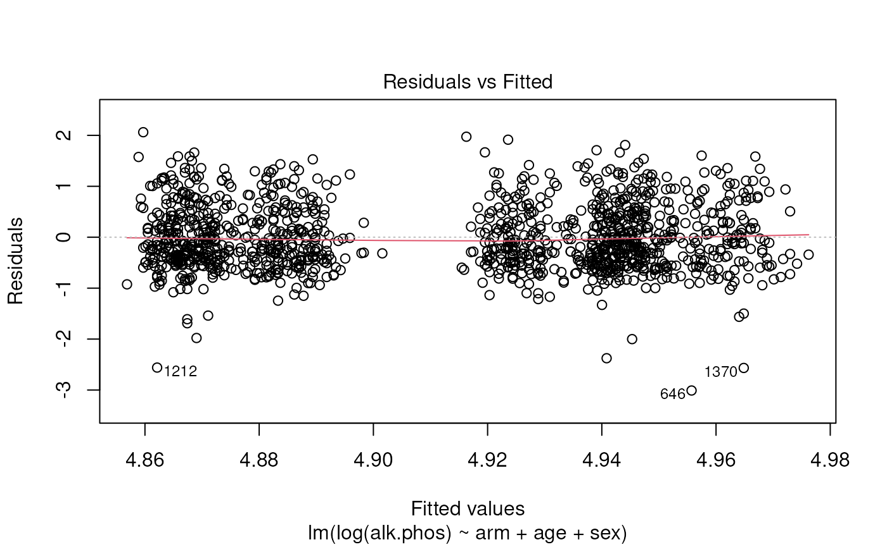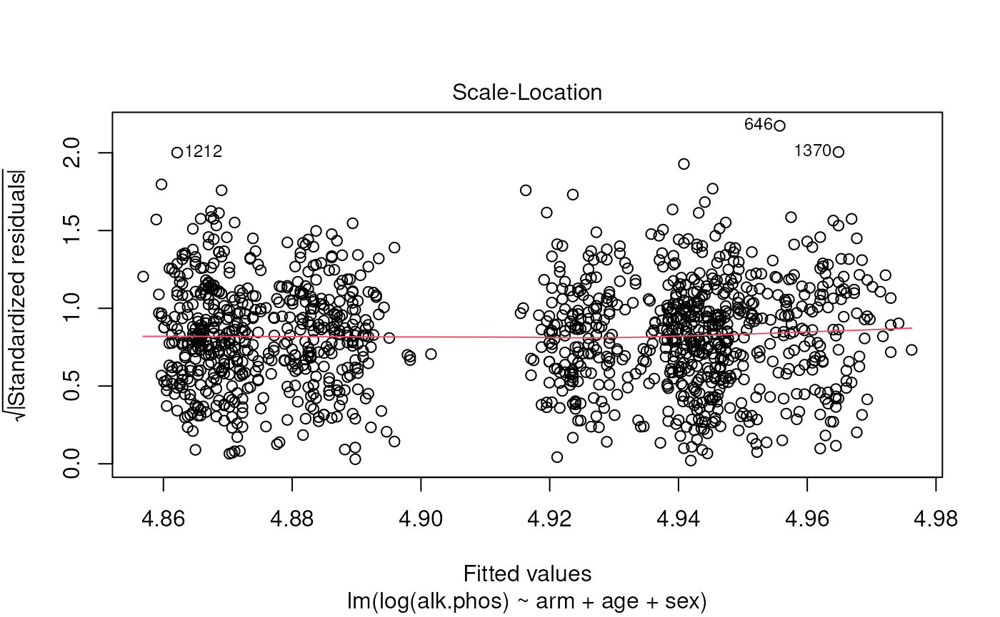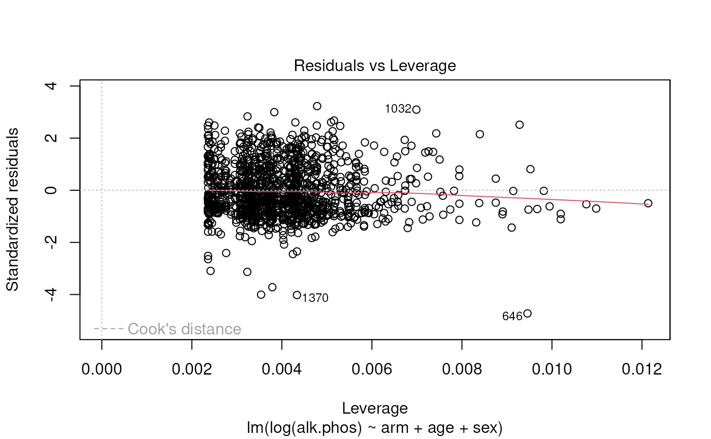

Finally, look to see whether there there is a non-linear relationship
with age.

``` r
> require(splines)
Loading required package: splines
> fit3 <- lm(log(alk.phos) ~ arm + ns(age, df=2) + sex, data=mockstudy)
> 
> # test whether there is a difference between models 
> stats::anova(fit2,fit3)
Analysis of Variance Table

Model 1: log(alk.phos) ~ arm + age + sex
Model 2: log(alk.phos) ~ arm + ns(age, df = 2) + sex
  Res.Df    RSS Df Sum of Sq      F  Pr(>F)  
1   1228 503.19                              
2   1227 502.07  1    1.1137 2.7218 0.09924 .
---
Signif. codes:  0 '***' 0.001 '**' 0.01 '*' 0.05 '.' 0.1 ' ' 1
> 
> # look at functional form of age
> termplot(fit3, term=2, se=T, rug=T)
```

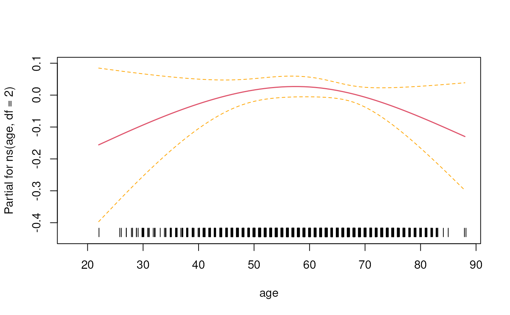

In this instance it looks like there isn’t enough evidence to say that
the relationship is non-linear.

#### Extract data using the `broom` package

The `broom` package makes it easy to extract information from the fit.

``` r
> tmp <- tidy(fit3) # coefficients, p-values
> class(tmp)
[1] "tbl_df"     "tbl"        "data.frame"
> tmp

[38;5;246m# A tibble: 6 × 5
[39m
  term             estimate std.error statistic   p.value
  
[3m
[38;5;246m<chr>
[39m
[23m               
[3m
[38;5;246m<dbl>
[39m
[23m     
[3m
[38;5;246m<dbl>
[39m
[23m     
[3m
[38;5;246m<dbl>
[39m
[23m     
[3m
[38;5;246m<dbl>
[39m
[23m

[38;5;250m1
[39m (Intercept)        4.76      0.141     33.8   1.93
[38;5;246me
[39m
[31m-177
[39m

[38;5;250m2
[39m armF: FOLFOX      -
[31m0
[39m
[31m.
[39m
[31m0
[39m
[31m76
[4m7
[24m
[39m    0.043
[4m4
[24m    -
[31m1
[39m
[31m.
[39m
[31m77
[39m  7.78
[38;5;246me
[39m
[31m-  2
[39m

[38;5;250m3
[39m armG: IROX        -
[31m0
[39m
[31m.
[39m
[31m0
[39m
[31m19
[4m5
[24m
[39m    0.049
[4m1
[24m    -
[31m0
[39m
[31m.
[39m
[31m396
[39m 6.92
[38;5;246me
[39m
[31m-  1
[39m

[38;5;250m4
[39m ns(age, df = 2)1   0.330     0.260      1.27  2.04
[38;5;246me
[39m
[31m-  1
[39m

[38;5;250m5
[39m ns(age, df = 2)2  -
[31m0
[39m
[31m.
[39m
[31m101
[39m     0.093
[4m5
[24m    -
[31m1
[39m
[31m.
[39m
[31m0
[39m
[31m8
[39m  2.82
[38;5;246me
[39m
[31m-  1
[39m

[38;5;250m6
[39m sexFemale          0.018
[4m3
[24m    0.037
[4m4
[24m     0.489 6.25
[38;5;246me
[39m
[31m-  1
[39m
> 
> glance(fit3)

[38;5;246m# A tibble: 1 × 12
[39m
  r.squared adj.r.squared sigma statistic p.value    df logLik   AIC   BIC
      
[3m
[38;5;246m<dbl>
[39m
[23m         
[3m
[38;5;246m<dbl>
[39m
[23m 
[3m
[38;5;246m<dbl>
[39m
[23m     
[3m
[38;5;246m<dbl>
[39m
[23m   
[3m
[38;5;246m<dbl>
[39m
[23m 
[3m
[38;5;246m<dbl>
[39m
[23m  
[3m
[38;5;246m<dbl>
[39m
[23m 
[3m
[38;5;246m<dbl>
[39m
[23m 
[3m
[38;5;246m<dbl>
[39m
[23m

[38;5;250m1
[39m   0.005
[4m3
[24m
[4m3
[24m       0.001
[4m2
[24m
[4m7
[24m 0.640      1.31   0.255     5 -
[31m
[4m1
[24m19
[39m
[31m6
[39m
[31m.
[39m 
[4m2
[24m405. 
[4m2
[24m441.

[38;5;246m# ℹ 3 more variables: deviance <dbl>, df.residual <int>, nobs <int>
[39m
```

#### Create a summary table using modelsum

``` r
> ms.logy <- modelsum(log(alk.phos) ~ arm + ps + hgb, data=mockstudy, adjust= ~age + sex, 
+                     family=gaussian,  
+                     gaussian.stats=c("estimate","CI.lower.estimate","CI.upper.estimate","p.value"))
> summary(ms.logy)
```

|  | estimate | CI.lower.estimate | CI.upper.estimate | p.value |
|:---|:---|:---|:---|:---|
| (Intercept) | 4.969 | 4.768 | 5.170 | \< 0.001 |
| **Treatment Arm F: FOLFOX** | -0.077 | -0.162 | 0.009 | 0.078 |
| **Treatment Arm G: IROX** | -0.019 | -0.116 | 0.077 | 0.695 |
| **Age in Years** | -0.000 | -0.004 | 0.003 | 0.798 |
| **sex Female** | 0.018 | -0.056 | 0.091 | 0.632 |
| (Intercept) | 4.832 | 4.640 | 5.023 | \< 0.001 |
| **ps** | 0.226 | 0.167 | 0.284 | \< 0.001 |
| **Age in Years** | -0.001 | -0.004 | 0.002 | 0.636 |
| **sex Female** | 0.009 | -0.063 | 0.081 | 0.814 |
| (Intercept) | 5.765 | 5.450 | 6.080 | \< 0.001 |
| **hgb** | -0.069 | -0.090 | -0.048 | \< 0.001 |
| **Age in Years** | 0.000 | -0.003 | 0.003 | 0.925 |
| **sex Female** | -0.027 | -0.101 | 0.046 | 0.468 |

### Binomial

#### Fit and summarize logistic regression model

``` r
> boxplot(age ~ mdquality.s, data=mockstudy, ylab=attr(mockstudy$age,'label'), xlab='mdquality.s')
```

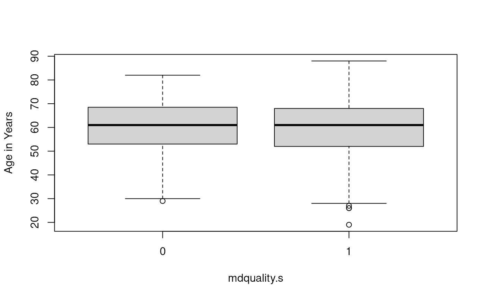

``` r
> 
> fit <- glm(mdquality.s ~ age + sex, data=mockstudy, family=binomial)
> summary(fit)

Call:
glm(formula = mdquality.s ~ age + sex, family = binomial, data = mockstudy)

Coefficients:
             Estimate Std. Error z value Pr(>|z|)    
(Intercept)  2.329442   0.514684   4.526 6.01e-06 ***
age         -0.002353   0.008256  -0.285    0.776    
sexFemale    0.039227   0.195330   0.201    0.841    
---
Signif. codes:  0 '***' 0.001 '**' 0.01 '*' 0.05 '.' 0.1 ' ' 1

(Dispersion parameter for binomial family taken to be 1)

    Null deviance: 807.68  on 1246  degrees of freedom
Residual deviance: 807.55  on 1244  degrees of freedom
  (252 observations deleted due to missingness)
AIC: 813.55

Number of Fisher Scoring iterations: 4
> 
> # create Odd's ratio w/ confidence intervals
> tmp <- data.frame(summary(fit)$coef)
> tmp
                Estimate  Std..Error    z.value     Pr...z..
(Intercept)  2.329441734 0.514683688  4.5259677 6.011977e-06
age         -0.002353404 0.008255814 -0.2850602 7.755980e-01
sexFemale    0.039227292 0.195330166  0.2008256 8.408350e-01
> 
> tmp$OR <- round(exp(tmp[,1]),2)
> tmp$lower.CI <- round(exp(tmp[,1] - 1.96* tmp[,2]),2)
> tmp$upper.CI <- round(exp(tmp[,1] + 1.96* tmp[,2]),2)
> names(tmp)[4] <- 'P-value'
> 
> kable(tmp[,c('OR','lower.CI','upper.CI','P-value')])
```

|             |    OR | lower.CI | upper.CI |  P-value |
|:------------|------:|---------:|---------:|---------:|
| (Intercept) | 10.27 |     3.75 |    28.17 | 0.000006 |
| age         |  1.00 |     0.98 |     1.01 | 0.775598 |
| sexFemale   |  1.04 |     0.71 |     1.53 | 0.840835 |

``` r
> 
> # Assess the predictive ability of the model
> 
> # code using the pROC package
> require(pROC)
> pred <- predict(fit, type='response')
> tmp <- pROC::roc(mockstudy$mdquality.s[!is.na(mockstudy$mdquality.s)]~ pred, plot=TRUE, percent=TRUE)
Setting levels: control = 0, case = 1
Setting direction: controls < cases
```

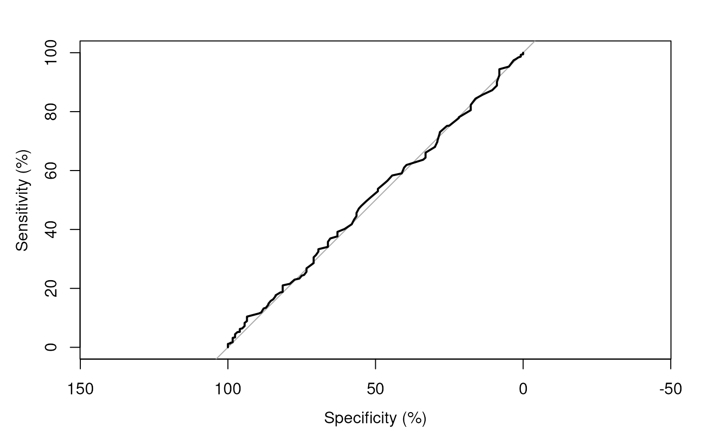

``` r
> tmp$auc
Area under the curve: 50.69%
```

#### Extract data using `broom` package

The `broom` package makes it easy to extract information from the fit.

``` r
> tidy(fit, exp=T, conf.int=T) # coefficients, p-values, conf.intervals

[38;5;246m# A tibble: 3 × 7
[39m
  term        estimate std.error statistic    p.value conf.low conf.high
  
[3m
[38;5;246m<chr>
[39m
[23m          
[3m
[38;5;246m<dbl>
[39m
[23m     
[3m
[38;5;246m<dbl>
[39m
[23m     
[3m
[38;5;246m<dbl>
[39m
[23m      
[3m
[38;5;246m<dbl>
[39m
[23m    
[3m
[38;5;246m<dbl>
[39m
[23m     
[3m
[38;5;246m<dbl>
[39m
[23m

[38;5;250m1
[39m (Intercept)   10.3     0.515       4.53  0.000
[4m0
[24m
[4m0
[24m
[4m6
[24m01    3.83      28.9 

[38;5;250m2
[39m age            0.998   0.008
[4m2
[24m
[4m6
[24m    -
[31m0
[39m
[31m.
[39m
[31m285
[39m 0.776         0.981      1.01

[38;5;250m3
[39m sexFemale      1.04    0.195       0.201 0.841         0.712      1.53
> 
> glance(fit) # model summary statistics

[38;5;246m# A tibble: 1 × 8
[39m
  null.deviance df.null logLik   AIC   BIC deviance df.residual  nobs
          
[3m
[38;5;246m<dbl>
[39m
[23m   
[3m
[38;5;246m<int>
[39m
[23m  
[3m
[38;5;246m<dbl>
[39m
[23m 
[3m
[38;5;246m<dbl>
[39m
[23m 
[3m
[38;5;246m<dbl>
[39m
[23m    
[3m
[38;5;246m<dbl>
[39m
[23m       
[3m
[38;5;246m<int>
[39m
[23m 
[3m
[38;5;246m<int>
[39m
[23m

[38;5;250m1
[39m          808.    
[4m1
[24m246  -
[31m404
[39m
[31m.
[39m  814.  829.     808.        
[4m1
[24m244  
[4m1
[24m247
```

#### Create a summary table using modelsum

``` r
> summary(modelsum(mdquality.s ~ age + bmi, data=mockstudy, adjust=~sex, family=binomial))
```

|  | OR | CI.lower.OR | CI.upper.OR | p.value | concordance | Nmiss |
|:---|:---|:---|:---|:---|:---|:---|
| (Intercept) | 10.272 | 3.831 | 28.876 | \< 0.001 | 0.507 | 252 |
| **Age in Years** | 0.998 | 0.981 | 1.014 | 0.776 |  |  |
| **sex Female** | 1.040 | 0.712 | 1.534 | 0.841 |  |  |
| (Intercept) | 4.814 | 1.709 | 13.221 | 0.003 | 0.550 | 273 |
| **Body Mass Index (kg/m^2)** | 1.023 | 0.987 | 1.063 | 0.220 |  |  |
| **sex Female** | 1.053 | 0.717 | 1.561 | 0.794 |  |  |

``` r
> 
> fitall <- modelsum(mdquality.s ~ age, data=mockstudy, family=binomial,
+                    binomial.stats=c("Nmiss2","OR","p.value"))
> summary(fitall)
```

|                  | OR     | p.value  | Nmiss2 |
|:-----------------|:-------|:---------|:-------|
| (Intercept)      | 10.493 | \< 0.001 | 252    |
| **Age in Years** | 0.998  | 0.766    |        |

### Survival

#### Fit and summarize a Cox regression model

``` r
> require(survival)
Loading required package: survival
> 
> # multivariable model with all 3 terms
> fit  <- coxph(Surv(fu.time, fu.stat) ~ age + sex + arm, data=mockstudy)
> summary(fit)
Call:
coxph(formula = Surv(fu.time, fu.stat) ~ age + sex + arm, data = mockstudy)

  n= 1499, number of events= 1356 

                  coef exp(coef)  se(coef)      z Pr(>|z|)    
age           0.004600  1.004611  0.002501  1.839   0.0659 .  
sexFemale     0.039893  1.040699  0.056039  0.712   0.4765    
armF: FOLFOX -0.454650  0.634670  0.064878 -7.008 2.42e-12 ***
armG: IROX   -0.140785  0.868676  0.072760 -1.935   0.0530 .  
---
Signif. codes:  0 '***' 0.001 '**' 0.01 '*' 0.05 '.' 0.1 ' ' 1

             exp(coef) exp(-coef) lower .95 upper .95
age             1.0046     0.9954    0.9997    1.0095
sexFemale       1.0407     0.9609    0.9324    1.1615
armF: FOLFOX    0.6347     1.5756    0.5589    0.7207
armG: IROX      0.8687     1.1512    0.7532    1.0018

Concordance= 0.563  (se = 0.009 )
Likelihood ratio test= 56.21  on 4 df,   p=2e-11
Wald test            = 56.26  on 4 df,   p=2e-11
Score (logrank) test = 56.96  on 4 df,   p=1e-11
> 
> # check proportional hazards assumption
> fit.z <- cox.zph(fit)
> fit.z
       chisq df    p
age     1.41  1 0.24
sex     1.08  1 0.30
arm     1.80  2 0.41
GLOBAL  4.68  4 0.32
> plot(fit.z[1], resid=FALSE) # makes for a cleaner picture in this case
> abline(h=coef(fit)[1], col='red')
```

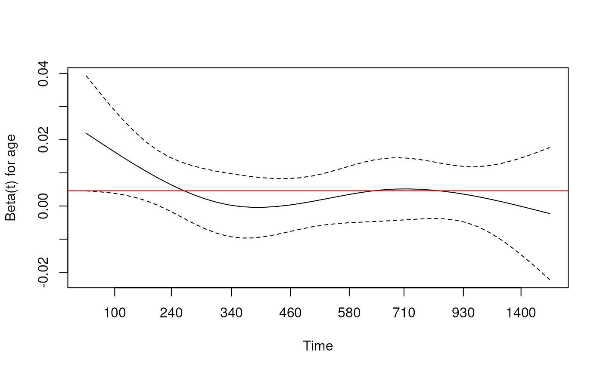

``` r
> 
> # check functional form for age using pspline (penalized spline)
> # results are returned for the linear and non-linear components
> fit2 <- coxph(Surv(fu.time, fu.stat) ~ pspline(age) + sex + arm, data=mockstudy)
> fit2
Call:
coxph(formula = Surv(fu.time, fu.stat) ~ pspline(age) + sex + 
    arm, data = mockstudy)

                         coef se(coef)      se2    Chisq   DF       p
pspline(age), linear  0.00443  0.00237  0.00237  3.48989 1.00  0.0617
pspline(age), nonlin                            13.11270 3.08  0.0047
sexFemale             0.03993  0.05610  0.05607  0.50663 1.00  0.4766
armF: FOLFOX         -0.46240  0.06494  0.06493 50.69608 1.00 1.1e-12
armG: IROX           -0.15243  0.07301  0.07299  4.35876 1.00  0.0368

Iterations: 6 outer, 16 Newton-Raphson
     Theta= 0.954 
Degrees of freedom for terms= 4.1 1.0 2.0 
Likelihood ratio test=70.1  on 7.08 df, p=2e-12
n= 1499, number of events= 1356 
> 
> # plot smoothed age to visualize why significant
> termplot(fit2, se=T, terms=1)
> abline(h=0)
```

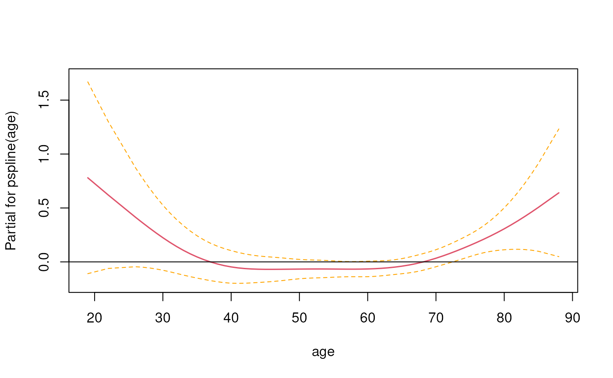

``` r
> 
> # The c-statistic comes out in the summary of the fit
> summary(fit2)$concordance
          C       se(C) 
0.568432549 0.008487495 
> 
> # It can also be calculated using the survConcordance function
> survConcordance(Surv(fu.time, fu.stat) ~ predict(fit2), data=mockstudy)
Warning in survConcordance(Surv(fu.time, fu.stat) ~ predict(fit2), data = mockstudy): 'survConcordance' is deprecated.
Use 'concordance' instead.
See help("Deprecated")
Warning in survConcordance.fit(Y, x, strat, wt): 'survConcordance.fit' is deprecated.
Use 'concordancefit' instead.
See help("Deprecated")
$concordance
concordant 
 0.5684325 

$stats
concordant discordant  tied.risk  tied.time   std(c-d) 
 620221.00  470282.00    5021.00     766.00   19235.49 

$n
[1] 1499

$std.err
   std(c-d) 
0.008779125 

$call
survConcordance(formula = Surv(fu.time, fu.stat) ~ predict(fit2), 
    data = mockstudy)

attr(,"class")
[1] "survConcordance"
```

#### Extract data using `broom` package

The `broom` package makes it easy to extract information from the fit.

``` r
> tidy(fit) # coefficients, p-values

[38;5;246m# A tibble: 4 × 5
[39m
  term         estimate std.error statistic  p.value
  
[3m
[38;5;246m<chr>
[39m
[23m           
[3m
[38;5;246m<dbl>
[39m
[23m     
[3m
[38;5;246m<dbl>
[39m
[23m     
[3m
[38;5;246m<dbl>
[39m
[23m    
[3m
[38;5;246m<dbl>
[39m
[23m

[38;5;250m1
[39m age           0.004
[4m6
[24m
[4m0
[24m   0.002
[4m5
[24m
[4m0
[24m     1.84  6.59
[38;5;246me
[39m
[31m- 2
[39m

[38;5;250m2
[39m sexFemale     0.039
[4m9
[24m    0.056
[4m0
[24m      0.712 4.77
[38;5;246me
[39m
[31m- 1
[39m

[38;5;250m3
[39m armF: FOLFOX -
[31m0
[39m
[31m.
[39m
[31m455
[39m     0.064
[4m9
[24m     -
[31m7
[39m
[31m.
[39m
[31m0
[39m
[31m1
[39m  2.42
[38;5;246me
[39m
[31m-12
[39m

[38;5;250m4
[39m armG: IROX   -
[31m0
[39m
[31m.
[39m
[31m141
[39m     0.072
[4m8
[24m     -
[31m1
[39m
[31m.
[39m
[31m93
[39m  5.30
[38;5;246me
[39m
[31m- 2
[39m
> 
> glance(fit) # model summary statistics

[38;5;246m# A tibble: 1 × 18
[39m
      n nevent statistic.log p.value.log statistic.sc p.value.sc statistic.wald
  
[3m
[38;5;246m<int>
[39m
[23m  
[3m
[38;5;246m<dbl>
[39m
[23m         
[3m
[38;5;246m<dbl>
[39m
[23m       
[3m
[38;5;246m<dbl>
[39m
[23m        
[3m
[38;5;246m<dbl>
[39m
[23m      
[3m
[38;5;246m<dbl>
[39m
[23m          
[3m
[38;5;246m<dbl>
[39m
[23m

[38;5;250m1
[39m  
[4m1
[24m499   
[4m1
[24m356          56.2    1.81
[38;5;246me
[39m
[31m-11
[39m         57.0   1.26
[38;5;246me
[39m
[31m-11
[39m           56.3

[38;5;246m# ℹ 11 more variables: p.value.wald <dbl>, statistic.robust <dbl>,
[39m

[38;5;246m#   p.value.robust <dbl>, r.squared <dbl>, r.squared.max <dbl>,
[39m

[38;5;246m#   concordance <dbl>, std.error.concordance <dbl>, logLik <dbl>, AIC <dbl>,
[39m

[38;5;246m#   BIC <dbl>, nobs <dbl>
[39m
```

#### Create a summary table using modelsum

``` r
> ##Note: You must use quotes when specifying family="survival" 
> ##      family=survival will not work
> summary(modelsum(Surv(fu.time, fu.stat) ~ arm, 
+                  adjust=~age + sex, data=mockstudy, family="survival"))
```

|  | HR | CI.lower.HR | CI.upper.HR | p.value | concordance |
|:---|:---|:---|:---|:---|:---|
| **Treatment Arm F: FOLFOX** | 0.635 | 0.559 | 0.721 | \< 0.001 | 0.563 |
| **Treatment Arm G: IROX** | 0.869 | 0.753 | 1.002 | 0.053 |  |
| **Age in Years** | 1.005 | 1.000 | 1.010 | 0.066 |  |
| **sex Female** | 1.041 | 0.932 | 1.162 | 0.477 |  |

``` r
> 
> ##Note: the pspline term is not working yet
> #summary(modelsum(Surv(fu.time, fu.stat) ~ arm, 
> #                adjust=~pspline(age) + sex, data=mockstudy, family='survival'))
```

### Poisson

Poisson regression is useful when predicting an outcome variable
representing counts. It can also be useful when looking at survival
data. Cox models and Poisson models are very closely related and
survival data can be summarized using Poisson regression. If you have
overdispersion (see if the residual deviance is much larger than degrees
of freedom), you may want to use
[`quasipoisson()`](https://rdrr.io/r/stats/family.html) instead of
[`poisson()`](https://rdrr.io/r/stats/family.html). Some of these
diagnostics need to be done outside of `modelsum`.

#### Example 1: fit and summarize a Poisson regression model

For the first example, use the solder dataset available in the `rpart`
package. The endpoint `skips` has a definite Poisson look.

``` r
> require(rpart) ##just to get access to solder dataset
> data(solder)
> hist(solder$skips)
```

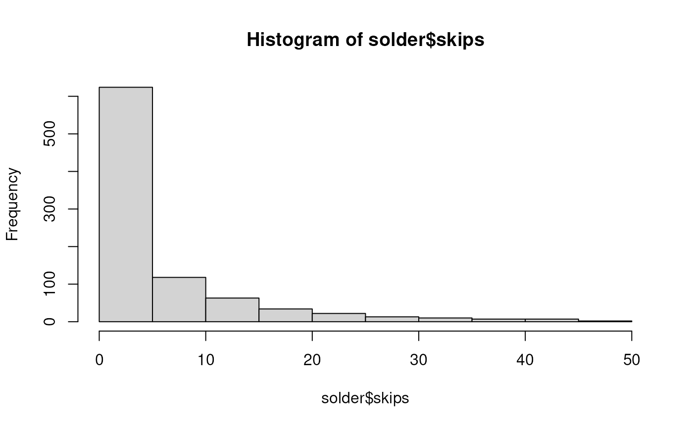

``` r
> 
> fit <- glm(skips ~ Opening + Solder + Mask , data=solder, family=poisson)
> stats::anova(fit, test='Chi')
Analysis of Deviance Table

Model: poisson, link: log

Response: skips

Terms added sequentially (first to last)

        Df Deviance Resid. Df Resid. Dev  Pr(>Chi)    
NULL                      899     8788.2              
Opening  2   2920.5       897     5867.7 < 2.2e-16 ***
Solder   1   1168.4       896     4699.3 < 2.2e-16 ***
Mask     4   2015.7       892     2683.7 < 2.2e-16 ***
---
Signif. codes:  0 '***' 0.001 '**' 0.01 '*' 0.05 '.' 0.1 ' ' 1
> summary(fit)

Call:
glm(formula = skips ~ Opening + Solder + Mask, family = poisson, 
    data = solder)

Coefficients:
            Estimate Std. Error z value Pr(>|z|)    
(Intercept) -1.12220    0.07742  -14.50  < 2e-16 ***
OpeningM     0.57161    0.05707   10.02  < 2e-16 ***
OpeningS     1.81475    0.05044   35.98  < 2e-16 ***
SolderThin   0.84682    0.03327   25.45  < 2e-16 ***
MaskA3       0.51315    0.07098    7.23 4.83e-13 ***
MaskA6       1.81103    0.06609   27.40  < 2e-16 ***
MaskB3       1.20225    0.06697   17.95  < 2e-16 ***
MaskB6       1.86648    0.06310   29.58  < 2e-16 ***
---
Signif. codes:  0 '***' 0.001 '**' 0.01 '*' 0.05 '.' 0.1 ' ' 1

(Dispersion parameter for poisson family taken to be 1)

    Null deviance: 8788.2  on 899  degrees of freedom
Residual deviance: 2683.7  on 892  degrees of freedom
AIC: 4802.2

Number of Fisher Scoring iterations: 5
```

Overdispersion is when the Residual deviance is larger than the degrees
of freedom. This can be tested, approximately using the following code.
The goal is to have a p-value that is $`>0.05`$.

``` r
> 1-pchisq(fit$deviance, fit$df.residual)
[1] 0
```

One possible solution is to use the quasipoisson family instead of the
poisson family. This adjusts for the overdispersion.

``` r
> fit2 <- glm(skips ~ Opening + Solder + Mask, data=solder, family=quasipoisson)
> summary(fit2)

Call:
glm(formula = skips ~ Opening + Solder + Mask, family = quasipoisson, 
    data = solder)

Coefficients:
            Estimate Std. Error t value Pr(>|t|)    
(Intercept) -1.12220    0.13483  -8.323 3.19e-16 ***
OpeningM     0.57161    0.09939   5.751 1.22e-08 ***
OpeningS     1.81475    0.08784  20.660  < 2e-16 ***
SolderThin   0.84682    0.05794  14.615  < 2e-16 ***
MaskA3       0.51315    0.12361   4.151 3.62e-05 ***
MaskA6       1.81103    0.11510  15.735  < 2e-16 ***
MaskB3       1.20225    0.11663  10.308  < 2e-16 ***
MaskB6       1.86648    0.10989  16.984  < 2e-16 ***
---
Signif. codes:  0 '***' 0.001 '**' 0.01 '*' 0.05 '.' 0.1 ' ' 1

(Dispersion parameter for quasipoisson family taken to be 3.033198)

    Null deviance: 8788.2  on 899  degrees of freedom
Residual deviance: 2683.7  on 892  degrees of freedom
AIC: NA

Number of Fisher Scoring iterations: 5
```

#### Extract data using `broom` package

The `broom` package makes it easy to extract information from the fit.

``` r
> tidy(fit) # coefficients, p-values

[38;5;246m# A tibble: 8 × 5
[39m
  term        estimate std.error statistic   p.value
  
[3m
[38;5;246m<chr>
[39m
[23m          
[3m
[38;5;246m<dbl>
[39m
[23m     
[3m
[38;5;246m<dbl>
[39m
[23m     
[3m
[38;5;246m<dbl>
[39m
[23m     
[3m
[38;5;246m<dbl>
[39m
[23m

[38;5;250m1
[39m (Intercept)   -
[31m1
[39m
[31m.
[39m
[31m12
[39m     0.077
[4m4
[24m    -
[31m14
[39m
[31m.
[39m
[31m5
[39m  1.29
[38;5;246me
[39m
[31m- 47
[39m

[38;5;250m2
[39m OpeningM       0.572    0.057
[4m1
[24m     10.0  1.29
[38;5;246me
[39m
[31m- 23
[39m

[38;5;250m3
[39m OpeningS       1.81     0.050
[4m4
[24m     36.0  1.66
[38;5;246me
[39m
[31m-283
[39m

[38;5;250m4
[39m SolderThin     0.847    0.033
[4m3
[24m     25.5  6.47
[38;5;246me
[39m
[31m-143
[39m

[38;5;250m5
[39m MaskA3         0.513    0.071
[4m0
[24m      7.23 4.83
[38;5;246me
[39m
[31m- 13
[39m

[38;5;250m6
[39m MaskA6         1.81     0.066
[4m1
[24m     27.4  2.45
[38;5;246me
[39m
[31m-165
[39m

[38;5;250m7
[39m MaskB3         1.20     0.067
[4m0
[24m     18.0  4.55
[38;5;246me
[39m
[31m- 72
[39m

[38;5;250m8
[39m MaskB6         1.87     0.063
[4m1
[24m     29.6  2.71
[38;5;246me
[39m
[31m-192
[39m
> 
> glance(fit) # model summary statistics

[38;5;246m# A tibble: 1 × 8
[39m
  null.deviance df.null logLik   AIC   BIC deviance df.residual  nobs
          
[3m
[38;5;246m<dbl>
[39m
[23m   
[3m
[38;5;246m<int>
[39m
[23m  
[3m
[38;5;246m<dbl>
[39m
[23m 
[3m
[38;5;246m<dbl>
[39m
[23m 
[3m
[38;5;246m<dbl>
[39m
[23m    
[3m
[38;5;246m<dbl>
[39m
[23m       
[3m
[38;5;246m<int>
[39m
[23m 
[3m
[38;5;246m<int>
[39m
[23m

[38;5;250m1
[39m         
[4m8
[24m788.     899 -
[31m
[4m2
[24m39
[39m
[31m3
[39m
[31m.
[39m 
[4m4
[24m802. 
[4m4
[24m841.    
[4m2
[24m684.         892   900
```

#### Create a summary table using modelsum

``` r
> summary(modelsum(skips~Opening + Solder + Mask, data=solder, family="quasipoisson"))
```

|                 | RR    | CI.lower.RR | CI.upper.RR | p.value  |
|:----------------|:------|:------------|:------------|:---------|
| (Intercept)     | 1.533 | 1.179       | 1.952       | \< 0.001 |
| **Opening M**   | 2.328 | 1.733       | 3.167       | \< 0.001 |
| **Opening S**   | 7.491 | 5.780       | 9.888       | \< 0.001 |
| (Intercept)     | 2.904 | 2.423       | 3.446       | \< 0.001 |
| **Solder Thin** | 2.808 | 2.295       | 3.458       | \< 0.001 |
| (Intercept)     | 1.611 | 1.135       | 2.204       | 0.005    |
| **Mask A3**     | 1.469 | 0.995       | 2.214       | 0.059    |
| **Mask A6**     | 8.331 | 5.839       | 12.222      | \< 0.001 |
| **Mask B3**     | 3.328 | 2.309       | 4.920       | \< 0.001 |
| **Mask B6**     | 6.466 | 4.598       | 9.378       | \< 0.001 |

``` r
> summary(modelsum(skips~Opening + Solder + Mask, data=solder, family="poisson"))
```

|                 | RR    | CI.lower.RR | CI.upper.RR | p.value  |
|:----------------|:------|:------------|:------------|:---------|
| (Intercept)     | 1.533 | 1.397       | 1.678       | \< 0.001 |
| **Opening M**   | 2.328 | 2.089       | 2.599       | \< 0.001 |
| **Opening S**   | 7.491 | 6.805       | 8.267       | \< 0.001 |
| (Intercept)     | 2.904 | 2.750       | 3.065       | \< 0.001 |
| **Solder Thin** | 2.808 | 2.637       | 2.992       | \< 0.001 |
| (Intercept)     | 1.611 | 1.433       | 1.804       | \< 0.001 |
| **Mask A3**     | 1.469 | 1.280       | 1.690       | \< 0.001 |
| **Mask A6**     | 8.331 | 7.341       | 9.487       | \< 0.001 |
| **Mask B3**     | 3.328 | 2.923       | 3.800       | \< 0.001 |
| **Mask B6**     | 6.466 | 5.724       | 7.331       | \< 0.001 |

#### Example 2: fit and summarize a Poisson regression model

This second example uses the survival endpoint available in the
`mockstudy` dataset. There is a close relationship between survival and
Poisson models, and often it is easier to fit the model using Poisson
regression, especially if you want to present absolute risk.

``` r
> # add .01 to the follow-up time (.01*1 day) in order to keep everyone in the analysis
> fit <- glm(fu.stat ~ offset(log(fu.time+.01)) + age + sex + arm, data=mockstudy, family=poisson)
> summary(fit)

Call:
glm(formula = fu.stat ~ offset(log(fu.time + 0.01)) + age + sex + 
    arm, family = poisson, data = mockstudy)

Coefficients:
              Estimate Std. Error z value Pr(>|z|)    
(Intercept)  -5.875627   0.108984 -53.913  < 2e-16 ***
age           0.003724   0.001705   2.184   0.0290 *  
sexFemale     0.027321   0.038575   0.708   0.4788    
armF: FOLFOX -0.335141   0.044600  -7.514 5.72e-14 ***
armG: IROX   -0.107776   0.050643  -2.128   0.0333 *  
---
Signif. codes:  0 '***' 0.001 '**' 0.01 '*' 0.05 '.' 0.1 ' ' 1

(Dispersion parameter for poisson family taken to be 1)

    Null deviance: 2113.5  on 1498  degrees of freedom
Residual deviance: 2048.0  on 1494  degrees of freedom
AIC: 5888.2

Number of Fisher Scoring iterations: 5
> 1-pchisq(fit$deviance, fit$df.residual)
[1] 0
> 
> coef(coxph(Surv(fu.time,fu.stat) ~ age + sex + arm, data=mockstudy))
         age    sexFemale armF: FOLFOX   armG: IROX 
 0.004600011  0.039892735 -0.454650445 -0.140784996 
> coef(fit)[-1]
         age    sexFemale armF: FOLFOX   armG: IROX 
 0.003723763  0.027320917 -0.335141090 -0.107775577 
> 
> # results from the Poisson model can then be described as risk ratios (similar to the hazard ratio)
> exp(coef(fit)[-1])
         age    sexFemale armF: FOLFOX   armG: IROX 
   1.0037307    1.0276976    0.7152372    0.8978291 
> 
> # As before, we can model the dispersion which alters the standard error
> fit2 <- glm(fu.stat ~ offset(log(fu.time+.01)) + age + sex + arm, 
+             data=mockstudy, family=quasipoisson)
> summary(fit2)

Call:
glm(formula = fu.stat ~ offset(log(fu.time + 0.01)) + age + sex + 
    arm, family = quasipoisson, data = mockstudy)

Coefficients:
              Estimate Std. Error t value Pr(>|t|)    
(Intercept)  -5.875627   0.566666 -10.369   <2e-16 ***
age           0.003724   0.008867   0.420    0.675    
sexFemale     0.027321   0.200572   0.136    0.892    
armF: FOLFOX -0.335141   0.231899  -1.445    0.149    
armG: IROX   -0.107776   0.263318  -0.409    0.682    
---
Signif. codes:  0 '***' 0.001 '**' 0.01 '*' 0.05 '.' 0.1 ' ' 1

(Dispersion parameter for quasipoisson family taken to be 27.03493)

    Null deviance: 2113.5  on 1498  degrees of freedom
Residual deviance: 2048.0  on 1494  degrees of freedom
AIC: NA

Number of Fisher Scoring iterations: 5
```

#### Extract data using `broom` package

The `broom` package makes it easy to extract information from the fit.

``` r
> tidy(fit) ##coefficients, p-values

[38;5;246m# A tibble: 5 × 5
[39m
  term         estimate std.error statistic  p.value
  
[3m
[38;5;246m<chr>
[39m
[23m           
[3m
[38;5;246m<dbl>
[39m
[23m     
[3m
[38;5;246m<dbl>
[39m
[23m     
[3m
[38;5;246m<dbl>
[39m
[23m    
[3m
[38;5;246m<dbl>
[39m
[23m

[38;5;250m1
[39m (Intercept)  -
[31m5
[39m
[31m.
[39m
[31m88
[39m      0.109     -
[31m53
[39m
[31m.
[39m
[31m9
[39m   0   
[38;5;246m 
[39m   

[38;5;250m2
[39m age           0.003
[4m7
[24m
[4m2
[24m   0.001
[4m7
[24m
[4m1
[24m     2.18  2.90
[38;5;246me
[39m
[31m- 2
[39m

[38;5;250m3
[39m sexFemale     0.027
[4m3
[24m    0.038
[4m6
[24m      0.708 4.79
[38;5;246me
[39m
[31m- 1
[39m

[38;5;250m4
[39m armF: FOLFOX -
[31m0
[39m
[31m.
[39m
[31m335
[39m     0.044
[4m6
[24m     -
[31m7
[39m
[31m.
[39m
[31m51
[39m  5.72
[38;5;246me
[39m
[31m-14
[39m

[38;5;250m5
[39m armG: IROX   -
[31m0
[39m
[31m.
[39m
[31m108
[39m     0.050
[4m6
[24m     -
[31m2
[39m
[31m.
[39m
[31m13
[39m  3.33
[38;5;246me
[39m
[31m- 2
[39m
> 
> glance(fit) ##model summary statistics

[38;5;246m# A tibble: 1 × 8
[39m
  null.deviance df.null logLik   AIC   BIC deviance df.residual  nobs
          
[3m
[38;5;246m<dbl>
[39m
[23m   
[3m
[38;5;246m<int>
[39m
[23m  
[3m
[38;5;246m<dbl>
[39m
[23m 
[3m
[38;5;246m<dbl>
[39m
[23m 
[3m
[38;5;246m<dbl>
[39m
[23m    
[3m
[38;5;246m<dbl>
[39m
[23m       
[3m
[38;5;246m<int>
[39m
[23m 
[3m
[38;5;246m<int>
[39m
[23m

[38;5;250m1
[39m         
[4m2
[24m114.    
[4m1
[24m498 -
[31m
[4m2
[24m93
[39m
[31m9
[39m
[31m.
[39m 
[4m5
[24m888. 
[4m5
[24m915.    
[4m2
[24m048.        
[4m1
[24m494  
[4m1
[24m499
```

#### Create a summary table using `modelsum`

Remember that the result from `modelsum` is different from the `fit`
above. The `modelsum` summary shows the results for
`age + offset(log(fu.time+.01))` then `sex + offset(log(fu.time+.01))`
instead of `age + sex + arm + offset(log(fu.time+.01))`.

``` r
> summary(modelsum(fu.stat ~ age, adjust=~offset(log(fu.time+.01))+ sex + arm, 
+                  data=mockstudy, family=poisson))
```

|                             | RR    | CI.lower.RR | CI.upper.RR | p.value  |
|:----------------------------|:------|:------------|:------------|:---------|
| (Intercept)                 | 0.003 | 0.002       | 0.003       | \< 0.001 |
| **Age in Years**            | 1.004 | 1.000       | 1.007       | 0.029    |
| **sex Female**              | 1.028 | 0.953       | 1.108       | 0.479    |
| **Treatment Arm F: FOLFOX** | 0.715 | 0.656       | 0.781       | \< 0.001 |
| **Treatment Arm G: IROX**   | 0.898 | 0.813       | 0.991       | 0.033    |

## Additional Examples

Here are multiple examples showing how to use some of the different
options.

### 1. Change summary statistics globally

There are standard settings for each type of model regarding what
information is summarized in the table. This behavior can be modified
using the modelsum.control function. In fact, you can save your standard
settings and use that for future tables.

``` r
> mycontrols  <- modelsum.control(gaussian.stats=c("estimate","std.error","adj.r.squared","Nmiss"),
+                                 show.adjust=FALSE, show.intercept=FALSE)                            
> tab2 <- modelsum(bmi ~ age, adjust=~sex, data=mockstudy, control=mycontrols)
> summary(tab2)
```

|                  | estimate | std.error | adj.r.squared | Nmiss |
|:-----------------|:---------|:----------|:--------------|:------|
| **Age in Years** | 0.012    | 0.012     | 0.004         | 33    |

You can also change these settings directly in the modelsum call.

``` r
> tab3 <- modelsum(bmi ~  age, adjust=~sex, data=mockstudy,
+                  gaussian.stats=c("estimate","std.error","adj.r.squared","Nmiss"), 
+                  show.intercept=FALSE, show.adjust=FALSE)
> summary(tab3)
```

|                  | estimate | std.error | adj.r.squared | Nmiss |
|:-----------------|:---------|:----------|:--------------|:------|
| **Age in Years** | 0.012    | 0.012     | 0.004         | 33    |

### 2. Add labels to independent variables

In the above example, age is shown with a label (Age in Years), but sex
is listed “as is”. This is because the data was created in SAS and in
the SAS dataset, age had a label but sex did not. The label is stored as
an attribute within R.

``` r
> ## Look at one variable's label
> attr(mockstudy$age,'label')
[1] "Age in Years"
> 
> ## See all the variables with a label
> unlist(lapply(mockstudy,'attr','label'))
                       age                        arm 
            "Age in Years"            "Treatment Arm" 
                      race                        bmi 
                    "Race" "Body Mass Index (kg/m^2)" 
> 
> ## or
> cbind(sapply(mockstudy,attr,'label'))
            [,1]                      
case        NULL                      
age         "Age in Years"            
arm         "Treatment Arm"           
sex         NULL                      
race        "Race"                    
fu.time     NULL                      
fu.stat     NULL                      
ps          NULL                      
hgb         NULL                      
bmi         "Body Mass Index (kg/m^2)"
alk.phos    NULL                      
ast         NULL                      
mdquality.s NULL                      
age.ord     NULL                      
```

If you want to add labels to other variables, there are a couple of
options. First, you could add labels to the variables in your dataset.

``` r
> attr(mockstudy$age,'label')  <- 'Age, yrs'
> 
> tab1 <- modelsum(bmi ~  age, adjust=~sex, data=mockstudy)
> summary(tab1)
```

|                | estimate | std.error | p.value  | adj.r.squared | Nmiss |
|:---------------|:---------|:----------|:---------|:--------------|:------|
| (Intercept)    | 26.793   | 0.766     | \< 0.001 | 0.004         | 33    |
| **Age, yrs**   | 0.012    | 0.012     | 0.348    |               |       |
| **sex Female** | -0.718   | 0.291     | 0.014    |               |       |

You can also use the built-in `data.frame` method for `labels<-`:

``` r
> labels(mockstudy)  <- c(age = 'Age, yrs')
> 
> tab1 <- modelsum(bmi ~  age, adjust=~sex, data=mockstudy)
> summary(tab1)
```

|                | estimate | std.error | p.value  | adj.r.squared | Nmiss |
|:---------------|:---------|:----------|:---------|:--------------|:------|
| (Intercept)    | 26.793   | 0.766     | \< 0.001 | 0.004         | 33    |
| **Age, yrs**   | 0.012    | 0.012     | 0.348    |               |       |
| **sex Female** | -0.718   | 0.291     | 0.014    |               |       |

Another option is to add labels after you have created the table

``` r
> mylabels <- list(sexFemale = "Female", age ="Age, yrs")
> summary(tab1, labelTranslations = mylabels)
```

|              | estimate | std.error | p.value  | adj.r.squared | Nmiss |
|:-------------|:---------|:----------|:---------|:--------------|:------|
| (Intercept)  | 26.793   | 0.766     | \< 0.001 | 0.004         | 33    |
| **Age, yrs** | 0.012    | 0.012     | 0.348    |               |       |
| **Female**   | -0.718   | 0.291     | 0.014    |               |       |

Alternatively, you can check the variable labels and manipulate them
with a function called `labels`, which works on the `modelsum` object.

``` r
> labels(tab1)
                       bmi                        age 
"Body Mass Index (kg/m^2)"                 "Age, yrs" 
                       sex 
              "sex Female" 
> labels(tab1) <- c(sexFemale="Female", age="Baseline Age (yrs)")
> labels(tab1)
                       bmi                        age 
"Body Mass Index (kg/m^2)"       "Baseline Age (yrs)" 
                       sex 
                  "Female" 
```

``` r
> summary(tab1)
```

|                        | estimate | std.error | p.value  | adj.r.squared | Nmiss |
|:-----------------------|:---------|:----------|:---------|:--------------|:------|
| (Intercept)            | 26.793   | 0.766     | \< 0.001 | 0.004         | 33    |
| **Baseline Age (yrs)** | 0.012    | 0.012     | 0.348    |               |       |
| **Female**             | -0.718   | 0.291     | 0.014    |               |       |

### 3. Don’t show intercept values

``` r
> summary(modelsum(age~mdquality.s+sex, data=mockstudy), show.intercept=FALSE)
```

|                 | estimate | std.error | p.value | adj.r.squared | Nmiss |
|:----------------|:---------|:----------|:--------|:--------------|:------|
| **mdquality.s** | -0.326   | 1.093     | 0.766   | -0.001        | 252   |
| **sex Female**  | -1.208   | 0.610     | 0.048   | 0.002         | 0     |

### 4. Don’t show results for adjustment variables

``` r
> summary(modelsum(mdquality.s ~ age + bmi, data=mockstudy, adjust=~sex, family=binomial),
+         show.adjust=FALSE)  
```

|  | OR | CI.lower.OR | CI.upper.OR | p.value | concordance | Nmiss |
|:---|:---|:---|:---|:---|:---|:---|
| (Intercept) | 10.272 | 3.831 | 28.876 | \< 0.001 | 0.507 | 252 |
| **Age, yrs** | 0.998 | 0.981 | 1.014 | 0.776 |  |  |
| (Intercept) | 4.814 | 1.709 | 13.221 | 0.003 | 0.550 | 273 |
| **Body Mass Index (kg/m^2)** | 1.023 | 0.987 | 1.063 | 0.220 |  |  |

### 5. Summarize multiple variables without typing them out

Often one wants to summarize a number of variables. Instead of typing by
hand each individual variable, an alternative approach is to create a
formula using the `paste` command with the `collapse="+"` option.

``` r
> # create a vector specifying the variable names
> myvars <- names(mockstudy)
> 
> # select the 8th through the 12th
> # paste them together, separated by the + sign
> RHS <- paste(myvars[8:12], collapse="+")
> RHS
```

\[1\] “ps+hgb+bmi+alk.phos+ast”

``` r
> 
> # create a formula using the as.formula function
> as.formula(paste('mdquality.s ~ ', RHS))
```

mdquality.s ~ ps + hgb + bmi + alk.phos + ast

``` r
> 
> # use the formula in the modelsum function
> summary(modelsum(as.formula(paste('mdquality.s ~', RHS)), family=binomial, data=mockstudy))
```

|  | OR | CI.lower.OR | CI.upper.OR | p.value | concordance | Nmiss |
|:---|:---|:---|:---|:---|:---|:---|
| (Intercept) | 14.628 | 10.755 | 20.399 | \< 0.001 | 0.620 | 460 |
| **ps** | 0.461 | 0.332 | 0.639 | \< 0.001 |  |  |
| (Intercept) | 1.236 | 0.272 | 5.560 | 0.783 | 0.573 | 460 |
| **hgb** | 1.176 | 1.040 | 1.334 | 0.011 |  |  |
| (Intercept) | 4.963 | 1.818 | 13.292 | 0.002 | 0.549 | 273 |
| **Body Mass Index (kg/m^2)** | 1.023 | 0.987 | 1.062 | 0.225 |  |  |
| (Intercept) | 10.622 | 7.687 | 14.794 | \< 0.001 | 0.552 | 460 |
| **alk.phos** | 0.999 | 0.998 | 1.000 | 0.159 |  |  |
| (Intercept) | 10.936 | 7.912 | 15.232 | \< 0.001 | 0.545 | 460 |
| **ast** | 0.995 | 0.988 | 1.001 | 0.099 |  |  |

These steps can also be done using the `formulize` function.

``` r
> ## The formulize function does the paste and as.formula steps
> tmp <- formulize('mdquality.s',myvars[8:10])
> tmp
```

mdquality.s ~ ps + hgb + bmi

``` r
> 
> ## More complex formulas could also be written using formulize
> tmp2 <- formulize('mdquality.s',c('ps','hgb','sqrt(bmi)'))
> 
> ## use the formula in the modelsum function
> summary(modelsum(tmp, data=mockstudy, family=binomial))
```

|  | OR | CI.lower.OR | CI.upper.OR | p.value | concordance | Nmiss |
|:---|:---|:---|:---|:---|:---|:---|
| (Intercept) | 14.628 | 10.755 | 20.399 | \< 0.001 | 0.620 | 460 |
| **ps** | 0.461 | 0.332 | 0.639 | \< 0.001 |  |  |
| (Intercept) | 1.236 | 0.272 | 5.560 | 0.783 | 0.573 | 460 |
| **hgb** | 1.176 | 1.040 | 1.334 | 0.011 |  |  |
| (Intercept) | 4.963 | 1.818 | 13.292 | 0.002 | 0.549 | 273 |
| **Body Mass Index (kg/m^2)** | 1.023 | 0.987 | 1.062 | 0.225 |  |  |

### 6. Subset the dataset used in the analysis

Here are two ways to get the same result (limit the analysis to subjects
age\>50 and in the F: FOLFOX treatment group).

- The first approach uses the subset function applied to the dataset
  `mockstudy`. This example also selects a subset of variables. The
  `modelsum` function is then applied to this subsetted data.

``` r
> newdata <- subset(mockstudy, subset=age>50 & arm=='F: FOLFOX', select = c(age,sex, bmi:alk.phos))
> dim(mockstudy)
[1] 1499   14
> table(mockstudy$arm)

   A: IFL F: FOLFOX   G: IROX 
      428       691       380 
> dim(newdata)
[1] 557   4
> names(newdata)
[1] "age"      "sex"      "bmi"      "alk.phos"
```

``` r
> summary(modelsum(alk.phos ~ ., data=newdata))
```

|                | estimate | std.error | p.value  | adj.r.squared | Nmiss |
|:---------------|:---------|:----------|:---------|:--------------|:------|
| (Intercept)    | 122.577  | 46.924    | 0.009    | -0.001        | 108   |
| **age**        | 0.619    | 0.719     | 0.390    |               |       |
| (Intercept)    | 164.814  | 7.673     | \< 0.001 | -0.002        | 108   |
| **sex Female** | -5.497   | 12.118    | 0.650    |               |       |
| (Intercept)    | 238.658  | 33.705    | \< 0.001 | 0.010         | 119   |
| **bmi**        | -2.776   | 1.207     | 0.022    |               |       |

- The second approach does the same analysis but uses the subset
  argument within `modelsum` to subset the data.

``` r
> summary(modelsum(log(alk.phos) ~ sex + ps + bmi, subset=age>50 & arm=="F: FOLFOX", data=mockstudy))
```

|                              | estimate | std.error | p.value  | adj.r.squared | Nmiss |
|:-----------------------------|:---------|:----------|:---------|:--------------|:------|
| (Intercept)                  | 4.872    | 0.039     | \< 0.001 | -0.002        | 108   |
| **sex Female**               | -0.005   | 0.062     | 0.931    |               |       |
| (Intercept)                  | 4.770    | 0.040     | \< 0.001 | 0.027         | 108   |
| **ps**                       | 0.183    | 0.050     | \< 0.001 |               |       |
| (Intercept)                  | 5.207    | 0.172     | \< 0.001 | 0.007         | 119   |
| **Body Mass Index (kg/m^2)** | -0.012   | 0.006     | 0.044    |               |       |

``` r
> summary(modelsum(alk.phos ~ ps + bmi, adjust=~sex, subset = age>50 & bmi<24, data=mockstudy))
```

|                              | estimate | std.error | p.value  | adj.r.squared | Nmiss |
|:-----------------------------|:---------|:----------|:---------|:--------------|:------|
| (Intercept)                  | 178.812  | 14.550    | \< 0.001 | 0.007         | 77    |
| **ps**                       | 20.834   | 13.440    | 0.122    |               |       |
| **sex Female**               | -17.542  | 16.656    | 0.293    |               |       |
| (Intercept)                  | 373.008  | 104.272   | \< 0.001 | 0.009         | 77    |
| **Body Mass Index (kg/m^2)** | -8.239   | 4.727     | 0.083    |               |       |
| **sex Female**               | -24.058  | 16.855    | 0.155    |               |       |

``` r
> summary(modelsum(alk.phos ~ ps + bmi, adjust=~sex, subset=1:30, data=mockstudy))
```

|                              | estimate | std.error | p.value  | adj.r.squared | Nmiss |
|:-----------------------------|:---------|:----------|:---------|:--------------|:------|
| (Intercept)                  | 169.112  | 57.013    | 0.006    | 0.294         | 0     |
| **ps**                       | 254.901  | 68.100    | \< 0.001 |               |       |
| **sex Female**               | 49.566   | 67.643    | 0.470    |               |       |
| (Intercept)                  | 453.070  | 200.651   | 0.033    | -0.049        | 1     |
| **Body Mass Index (kg/m^2)** | -5.993   | 7.408     | 0.426    |               |       |
| **sex Female**               | -22.308  | 79.776    | 0.782    |               |       |

### 7. Create combinations of variables on the fly

``` r
> ## create a variable combining the levels of mdquality.s and sex
> with(mockstudy, table(interaction(mdquality.s,sex)))

  0.Male   1.Male 0.Female 1.Female 
      77      686       47      437 
```

``` r
> summary(modelsum(age ~ interaction(mdquality.s,sex), data=mockstudy))
```

|  | estimate | std.error | p.value | adj.r.squared | Nmiss |
|:---|:---|:---|:---|:---|:---|
| (Intercept) | 59.714 | 1.314 | \< 0.001 | 0.003 | 252 |
| **interaction(mdquality.s, sex) 1.Male** | 0.730 | 1.385 | 0.598 |  |  |
| **interaction(mdquality.s, sex) 0.Female** | 0.988 | 2.134 | 0.643 |  |  |
| **interaction(mdquality.s, sex) 1.Female** | -1.021 | 1.425 | 0.474 |  |  |

### 8. Transform variables on the fly

Certain transformations need to be surrounded by
[`I()`](https://rdrr.io/r/base/AsIs.html) so that R knows to treat it as
a variable transformation and not some special model feature. If the
transformation includes any of the symbols `/ - + ^ *` then surround the
new variable by [`I()`](https://rdrr.io/r/base/AsIs.html).

``` r
> summary(modelsum(arm=="F: FOLFOX" ~ I(age/10) + log(bmi) + mdquality.s,
+                  data=mockstudy, family=binomial))
```

|  | OR | CI.lower.OR | CI.upper.OR | p.value | concordance | Nmiss |
|:---|:---|:---|:---|:---|:---|:---|
| (Intercept) | 0.656 | 0.382 | 1.124 | 0.126 | 0.514 | 0 |
| **Age, yrs** | 1.045 | 0.957 | 1.142 | 0.326 |  |  |
| (Intercept) | 0.633 | 0.108 | 3.698 | 0.611 | 0.508 | 33 |
| **Body Mass Index (kg/m^2)** | 1.092 | 0.638 | 1.867 | 0.748 |  |  |
| (Intercept) | 0.722 | 0.503 | 1.029 | 0.074 | 0.502 | 252 |
| **mdquality.s** | 1.045 | 0.719 | 1.527 | 0.819 |  |  |

### 9. Change the ordering of the variables or delete a variable

``` r
> mytab <- modelsum(bmi ~ sex + alk.phos + age, data=mockstudy)
> mytab2 <- mytab[c('age','sex','alk.phos')]
> summary(mytab2)
```

|                | estimate | std.error | p.value  | adj.r.squared | Nmiss |
|:---------------|:---------|:----------|:---------|:--------------|:------|
| (Intercept)    | 26.424   | 0.752     | \< 0.001 | 0.000         | 33    |
| **Age, yrs**   | 0.013    | 0.012     | 0.290    |               |       |
| (Intercept)    | 27.491   | 0.181     | \< 0.001 | 0.004         | 33    |
| **sex Female** | -0.731   | 0.290     | 0.012    |               |       |
| (Intercept)    | 27.944   | 0.253     | \< 0.001 | 0.011         | 294   |
| **alk.phos**   | -0.005   | 0.001     | \< 0.001 |               |       |

``` r
> summary(mytab[c('age','sex')])
```

|                | estimate | std.error | p.value  | adj.r.squared | Nmiss |
|:---------------|:---------|:----------|:---------|:--------------|:------|
| (Intercept)    | 26.424   | 0.752     | \< 0.001 | 0.000         | 33    |
| **Age, yrs**   | 0.013    | 0.012     | 0.290    |               |       |
| (Intercept)    | 27.491   | 0.181     | \< 0.001 | 0.004         | 33    |
| **sex Female** | -0.731   | 0.290     | 0.012    |               |       |

``` r
> summary(mytab[c(3,1)])
```

|                | estimate | std.error | p.value  | adj.r.squared | Nmiss |
|:---------------|:---------|:----------|:---------|:--------------|:------|
| (Intercept)    | 26.424   | 0.752     | \< 0.001 | 0.000         | 33    |
| **Age, yrs**   | 0.013    | 0.012     | 0.290    |               |       |
| (Intercept)    | 27.491   | 0.181     | \< 0.001 | 0.004         | 33    |
| **sex Female** | -0.731   | 0.290     | 0.012    |               |       |

### 10. Merge two `modelsum` objects together

It is possible to merge two modelsum objects so that they print out
together, however you need to pay attention to the columns that are
being displayed. It is sometimes easier to combine two models of the
same family (such as two sets of linear models). Overlapping y-variables
will have their x-variables concatenated, and (if `all=TRUE`)
non-overlapping y-variables will have their tables printed separately.

``` r
> ## demographics
> tab1 <- modelsum(bmi ~ sex + age, data=mockstudy)
> ## lab data
> tab2 <- modelsum(mdquality.s ~ hgb + alk.phos, data=mockstudy, family=binomial)
>                 
> tab12 <- merge(tab1, tab2, all = TRUE)
> class(tab12)
```

\[1\] “modelsum” “arsenal_table”

``` r
> summary(tab12)
```

|                | estimate | std.error | p.value  | adj.r.squared | Nmiss |
|:---------------|:---------|:----------|:---------|:--------------|:------|
| (Intercept)    | 27.491   | 0.181     | \< 0.001 | 0.004         | 33    |
| **sex Female** | -0.731   | 0.290     | 0.012    |               |       |
| (Intercept)    | 26.424   | 0.752     | \< 0.001 | 0.000         | 33    |
| **Age, yrs**   | 0.013    | 0.012     | 0.290    |               |       |

|              | OR     | CI.lower.OR | CI.upper.OR | p.value  | concordance | Nmiss |
|:-------------|:-------|:------------|:------------|:---------|:------------|:------|
| (Intercept)  | 1.236  | 0.272       | 5.560       | 0.783    | 0.573       | 460   |
| **hgb**      | 1.176  | 1.040       | 1.334       | 0.011    |             |       |
| (Intercept)  | 10.622 | 7.687       | 14.794      | \< 0.001 | 0.552       | 460   |
| **alk.phos** | 0.999  | 0.998       | 1.000       | 0.159    |             |       |

### 11. Add a title to the table

When creating a pdf the tables are automatically numbered and the title
appears below the table. In Word and HTML, the titles appear un-numbered
and above the table.

``` r
> t1 <- modelsum(bmi ~ sex + age, data=mockstudy)
> summary(t1, title='Demographics')
```

|                | estimate | std.error | p.value  | adj.r.squared | Nmiss |
|:---------------|:---------|:----------|:---------|:--------------|:------|
| (Intercept)    | 27.491   | 0.181     | \< 0.001 | 0.004         | 33    |
| **sex Female** | -0.731   | 0.290     | 0.012    |               |       |
| (Intercept)    | 26.424   | 0.752     | \< 0.001 | 0.000         | 33    |
| **Age, yrs**   | 0.013    | 0.012     | 0.290    |               |       |

Demographics {.table}

### 12. Modify how missing values are treated

Depending on the report you are writing you have the following options:

- Use all values available for each variable

- Use only those subjects who have measurements available for all the
  variables

``` r
> ## look at how many missing values there are for each variable
> apply(is.na(mockstudy),2,sum)
       case         age         arm         sex        race     fu.time 
          0           0           0           0           7           0 
    fu.stat          ps         hgb         bmi    alk.phos         ast 
          0         266         266          33         266         266 
mdquality.s     age.ord 
        252           0 
```

``` r
> ## Show how many subjects have each variable (non-missing)
> summary(modelsum(bmi ~ ast + age, data=mockstudy,
+                 control=modelsum.control(gaussian.stats=c("N","estimate"))))
```

|              | estimate | N    |
|:-------------|:---------|:-----|
| (Intercept)  | 27.331   | 1205 |
| **ast**      | -0.005   |      |
| (Intercept)  | 26.424   | 1466 |
| **Age, yrs** | 0.013    |      |

``` r
> 
> ## Always list the number of missing values
> summary(modelsum(bmi ~ ast + age, data=mockstudy,
+                 control=modelsum.control(gaussian.stats=c("Nmiss2","estimate"))))
```

|              | estimate | Nmiss2 |
|:-------------|:---------|:-------|
| (Intercept)  | 27.331   | 294    |
| **ast**      | -0.005   |        |
| (Intercept)  | 26.424   | 33     |
| **Age, yrs** | 0.013    |        |

``` r
> 
> ## Only show the missing values if there are some (default)
> summary(modelsum(bmi ~ ast + age, data=mockstudy, 
+                 control=modelsum.control(gaussian.stats=c("Nmiss","estimate"))))
```

|              | estimate | Nmiss |
|:-------------|:---------|:------|
| (Intercept)  | 27.331   | 294   |
| **ast**      | -0.005   |       |
| (Intercept)  | 26.424   | 33    |
| **Age, yrs** | 0.013    |       |

``` r
> 
> ## Don't show N at all
> summary(modelsum(bmi ~ ast + age, data=mockstudy, 
+                 control=modelsum.control(gaussian.stats=c("estimate"))))
```

|              | estimate |
|:-------------|:---------|
| (Intercept)  | 27.331   |
| **ast**      | -0.005   |
| (Intercept)  | 26.424   |
| **Age, yrs** | 0.013    |

### 13. Modify the number of digits used

Within modelsum.control function there are 3 options for controlling the
number of significant digits shown.

- digits: controls the number of digits after the decimal point for
  continuous values

- digits.ratio: controls the number of digits after the decimal point
  for continuous values

- digits.p: controls the number of digits after the decimal point for
  continuous values

``` r
> summary(modelsum(bmi ~ sex + age + fu.time, data=mockstudy), digits=4, digits.test=2)
Warning in modelsum.control(digits = 4, digits.test = 2, digits.ratio = 3L, :
Using 'digits.test = ' is deprecated. Use 'digits.p = ' instead.
```

|                | estimate | std.error | p.value  | adj.r.squared | Nmiss |
|:---------------|:---------|:----------|:---------|:--------------|:------|
| (Intercept)    | 27.4915  | 0.1813    | \< 0.001 | 0.0036        | 33    |
| **sex Female** | -0.7311  | 0.2903    | 0.012    |               |       |
| (Intercept)    | 26.4237  | 0.7521    | \< 0.001 | 0.0001        | 33    |
| **Age, yrs**   | 0.0130   | 0.0123    | 0.290    |               |       |
| (Intercept)    | 26.4937  | 0.2447    | \< 0.001 | 0.0079        | 33    |
| **fu.time**    | 0.0011   | 0.0003    | \< 0.001 |               |       |

### 14. Use case-weights in the models

Occasionally it is of interest to fit models using case weights. The
`modelsum` function allows you to pass on the weights to the models and
it will do the appropriate fit.

``` r
> mockstudy$agegp <- cut(mockstudy$age, breaks=c(18,50,60,70,90), right=FALSE)
> 
> ## create weights based on agegp and sex distribution
> tab1 <- with(mockstudy,table(agegp, sex))
> tab1
         sex
agegp     Male Female
  [18,50)  152    110
  [50,60)  258    178
  [60,70)  295    173
  [70,90)  211    122
> tab2 <- with(mockstudy, table(agegp, sex, arm))
> gpwts <- rep(tab1, length(unique(mockstudy$arm)))/tab2
> 
> ## apply weights to subjects
> index <- with(mockstudy, cbind(as.numeric(agegp), as.numeric(sex), as.numeric(as.factor(arm)))) 
> mockstudy$wts <- gpwts[index]
> 
> ## show weights by treatment arm group
> tapply(mockstudy$wts,mockstudy$arm, summary)
$`A: IFL`
   Min. 1st Qu.  Median    Mean 3rd Qu.    Max. 
  2.923   3.225   3.548   3.502   3.844   4.045 

$`F: FOLFOX`
   Min. 1st Qu.  Median    Mean 3rd Qu.    Max. 
  2.033   2.070   2.201   2.169   2.263   2.303 

$`G: IROX`
   Min. 1st Qu.  Median    Mean 3rd Qu.    Max. 
  3.667   3.734   4.023   3.945   4.031   4.471 
```

``` r
> mockstudy$newvarA <- as.numeric(mockstudy$arm=='A: IFL')
> tab1 <- modelsum(newvarA ~ ast + bmi + hgb, data=mockstudy, subset=(arm !='G: IROX'), 
+                  family=binomial)
> summary(tab1, title='No Case Weights used')
```

|  | OR | CI.lower.OR | CI.upper.OR | p.value | concordance | Nmiss |
|:---|:---|:---|:---|:---|:---|:---|
| (Intercept) | 0.590 | 0.473 | 0.735 | \< 0.001 | 0.550 | 210 |
| **ast** | 1.003 | 0.998 | 1.008 | 0.258 |  |  |
| (Intercept) | 0.578 | 0.306 | 1.093 | 0.091 | 0.500 | 29 |
| **Body Mass Index (kg/m^2)** | 1.003 | 0.980 | 1.026 | 0.808 |  |  |
| (Intercept) | 1.006 | 0.386 | 2.631 | 0.990 | 0.514 | 210 |
| **hgb** | 0.965 | 0.894 | 1.043 | 0.372 |  |  |

No Case Weights used {.table}

``` r
> 
> suppressWarnings({
+ tab2 <- modelsum(newvarA ~ ast + bmi + hgb, data=mockstudy, subset=(arm !='G: IROX'), 
+                  weights=wts, family=binomial)
+ summary(tab2, title='Case Weights used')
+ })
```

|  | OR | CI.lower.OR | CI.upper.OR | p.value | concordance | Nmiss |
|:---|:---|:---|:---|:---|:---|:---|
| (Intercept) | 0.956 | 0.837 | 1.091 | 0.504 | 0.550 | 210 |
| **ast** | 1.003 | 1.000 | 1.006 | 0.068 |  |  |
| (Intercept) | 0.957 | 0.658 | 1.393 | 0.820 | 0.500 | 29 |
| **Body Mass Index (kg/m^2)** | 1.002 | 0.988 | 1.016 | 0.780 |  |  |
| (Intercept) | 1.829 | 1.031 | 3.248 | 0.039 | 0.514 | 210 |
| **hgb** | 0.956 | 0.913 | 1.001 | 0.058 |  |  |

Case Weights used {.table}

### 15. Use `modelsum` within an Sweave document

For those users who wish to create tables within an Sweave document, the
following code seems to work.

    \documentclass{article}

    \usepackage{longtable}
    \usepackage{pdfpages}

    \begin{document}

    \section{Read in Data}
    <<echo=TRUE>>=
    require(arsenal)
    require(knitr)
    require(rmarkdown)
    data(mockstudy)

    tab1 <- modelsum(bmi~sex+age, data=mockstudy)
    @

    \section{Convert Summary.modelsum to LaTeX}
    <<echo=TRUE, results='hide', message=FALSE>>=
    capture.output(summary(tab1), file="Test.md")

    ## Convert R Markdown Table to LaTeX
    render("Test.md", pdf_document(keep_tex=TRUE))
    @ 

    \includepdf{Test.pdf}

    \end{document}

### 16. Export `modelsum` results to a .CSV file

When looking at multiple variables it is sometimes useful to export the
results to a csv file. The `as.data.frame` function creates a data frame
object that can be exported or further manipulated within R.

``` r
> summary(tab2, text=T)


|                         |OR    |CI.lower.OR |CI.upper.OR |p.value |concordance |Nmiss |
|:------------------------|:-----|:-----------|:-----------|:-------|:-----------|:-----|
|(Intercept)              |0.956 |0.837       |1.091       |0.504   |0.550       |210   |
|ast                      |1.003 |1.000       |1.006       |0.068   |            |      |
|(Intercept)              |0.957 |0.658       |1.393       |0.820   |0.500       |29    |
|Body Mass Index (kg/m^2) |1.002 |0.988       |1.016       |0.780   |            |      |
|(Intercept)              |1.829 |1.031       |3.248       |0.039   |0.514       |210   |
|hgb                      |0.956 |0.913       |1.001       |0.058   |            |      |
> tmp <- as.data.frame(summary(tab2, text = TRUE))
> tmp
                              OR CI.lower.OR CI.upper.OR p.value concordance
1              (Intercept) 0.956       0.837       1.091   0.504       0.550
2                      ast 1.003       1.000       1.006   0.068            
3              (Intercept) 0.957       0.658       1.393   0.820       0.500
4 Body Mass Index (kg/m^2) 1.002       0.988       1.016   0.780            
5              (Intercept) 1.829       1.031       3.248   0.039       0.514
6                      hgb 0.956       0.913       1.001   0.058            
  Nmiss
1   210
2      
3    29
4      
5   210
6      
> # write.csv(tmp, '/my/path/here/mymodel.csv')
```

### 17. Write `modelsum` object to a separate Word or HTML file

``` r
> ## write to an HTML document
> write2html(tab2, "~/ibm/trash.html")
> 
> ## write to a Word document
> write2word(tab2, "~/ibm/trash.doc", title="My table in Word")
```

### 18. Use `modelsum` in R Shiny

The easiest way to output a
[`modelsum()`](https://mayoverse.github.io/arsenal/reference/modelsum.md)
object in an R Shiny app is to use the `tableOutput()` UI in combination
with the `renderTable()` server function and
`as.data.frame(summary(modelsum()))`:

``` r
> # A standalone shiny app
> library(shiny)
> library(arsenal)
> data(mockstudy)
> 
> shinyApp(
+   ui = fluidPage(tableOutput("table")),
+   server = function(input, output) {
+     output$table <- renderTable({
+       as.data.frame(summary(modelsum(age ~ sex, data = mockstudy), text = "html"))
+     }, sanitize.text.function = function(x) x)
+   }
+ )
```

This can be especially powerful if you feed the selections from a
`selectInput(multiple = TRUE)` into
[`formulize()`](https://mayoverse.github.io/arsenal/reference/formulize.md)
to make the table dynamic!

### 23. Use `modelsum` in bookdown

Since the backbone of
[`modelsum()`](https://mayoverse.github.io/arsenal/reference/modelsum.md)
is [`knitr::kable()`](https://rdrr.io/pkg/knitr/man/kable.html), tables
still render well in bookdown. However, `print.summary.modelsum()`
doesn’t use the `caption=` argument of `kable()`, so some tables may not
have a properly numbered caption. To fix this, use the method described
[on the bookdown site](https://bookdown.org/yihui/bookdown/tables.html)
to give the table a tag/ID.

``` r
> summary(modelsum(age ~ sex, data = mockstudy), title="(\\#tab:mytableby) Caption here")
```

### 24. Model multiple endpoints

You can now use [`list()`](https://rdrr.io/r/base/list.html) on the
left-hand side of
[`modelsum()`](https://mayoverse.github.io/arsenal/reference/modelsum.md)
to give multiple endpoints. Note that only one “family” can be specified
this way (use [`merge()`](https://rdrr.io/r/base/merge.html) instead if
you want multiple families).

``` r
> summary(modelsum(list(age, hgb) ~ bmi + sex, adjust = ~ arm, data = mockstudy))
```

|                              | estimate | std.error | p.value  | adj.r.squared | Nmiss |
|:-----------------------------|:---------|:----------|:---------|:--------------|:------|
| (Intercept)                  | 58.053   | 1.614     | \< 0.001 | -0.001        | 33    |
| **Body Mass Index (kg/m^2)** | 0.059    | 0.055     | 0.289    |               |       |
| **Treatment Arm F: FOLFOX**  | 0.593    | 0.718     | 0.408    |               |       |
| **Treatment Arm G: IROX**    | 0.171    | 0.819     | 0.834    |               |       |
| (Intercept)                  | 60.108   | 0.597     | \< 0.001 | 0.001         | 0     |
| **sex Female**               | -1.232   | 0.611     | 0.044    |               |       |
| **Treatment Arm F: FOLFOX**  | 0.693    | 0.709     | 0.329    |               |       |
| **Treatment Arm G: IROX**    | 0.148    | 0.812     | 0.855    |               |       |

|                              | estimate | std.error | p.value  | adj.r.squared | Nmiss |
|:-----------------------------|:---------|:----------|:---------|:--------------|:------|
| (Intercept)                  | 11.565   | 0.267     | \< 0.001 | 0.005         | 294   |
| **Body Mass Index (kg/m^2)** | 0.028    | 0.009     | 0.003    |               |       |
| **Treatment Arm F: FOLFOX**  | 0.046    | 0.118     | 0.699    |               |       |
| **Treatment Arm G: IROX**    | 0.065    | 0.133     | 0.624    |               |       |
| (Intercept)                  | 12.505   | 0.096     | \< 0.001 | 0.032         | 266   |
| **sex Female**               | -0.642   | 0.099     | \< 0.001 |               |       |
| **Treatment Arm F: FOLFOX**  | 0.131    | 0.115     | 0.256    |               |       |
| **Treatment Arm G: IROX**    | 0.131    | 0.130     | 0.313    |               |       |

To avoid confusion about which table is which endpoint, you can set
`term.name=TRUE` in [`summary()`](https://rdrr.io/r/base/summary.html).
This takes the labels for each endpoint and puts them in the top-left of
the table.

``` r
> summary(modelsum(list(age, hgb) ~ bmi + sex, adjust = ~ arm, data = mockstudy), term.name = TRUE)
```

| Age, yrs                     | estimate | std.error | p.value  | adj.r.squared | Nmiss |
|:-----------------------------|:---------|:----------|:---------|:--------------|:------|
| (Intercept)                  | 58.053   | 1.614     | \< 0.001 | -0.001        | 33    |
| **Body Mass Index (kg/m^2)** | 0.059    | 0.055     | 0.289    |               |       |
| **Treatment Arm F: FOLFOX**  | 0.593    | 0.718     | 0.408    |               |       |
| **Treatment Arm G: IROX**    | 0.171    | 0.819     | 0.834    |               |       |
| (Intercept)                  | 60.108   | 0.597     | \< 0.001 | 0.001         | 0     |
| **sex Female**               | -1.232   | 0.611     | 0.044    |               |       |
| **Treatment Arm F: FOLFOX**  | 0.693    | 0.709     | 0.329    |               |       |
| **Treatment Arm G: IROX**    | 0.148    | 0.812     | 0.855    |               |       |

| hgb                          | estimate | std.error | p.value  | adj.r.squared | Nmiss |
|:-----------------------------|:---------|:----------|:---------|:--------------|:------|
| (Intercept)                  | 11.565   | 0.267     | \< 0.001 | 0.005         | 294   |
| **Body Mass Index (kg/m^2)** | 0.028    | 0.009     | 0.003    |               |       |
| **Treatment Arm F: FOLFOX**  | 0.046    | 0.118     | 0.699    |               |       |
| **Treatment Arm G: IROX**    | 0.065    | 0.133     | 0.624    |               |       |
| (Intercept)                  | 12.505   | 0.096     | \< 0.001 | 0.032         | 266   |
| **sex Female**               | -0.642   | 0.099     | \< 0.001 |               |       |
| **Treatment Arm F: FOLFOX**  | 0.131    | 0.115     | 0.256    |               |       |
| **Treatment Arm G: IROX**    | 0.131    | 0.130     | 0.313    |               |       |

### 25. Model data by a non-test group (strata)

You can also specify a grouping variable that doesn’t get tested (but
instead separates results): a *strata* variable.

``` r
> summary(modelsum(list(age, hgb) ~ bmi + sex, strata = arm, data = mockstudy))
```

| Treatment Arm |  | estimate | std.error | p.value | adj.r.squared | Nmiss |
|:---|:---|:---|:---|:---|:---|:---|
| A: IFL | (Intercept) | 59.147 | 2.783 | \< 0.001 | -0.002 | 9 |
|  | **Body Mass Index (kg/m^2)** | 0.019 | 0.100 | 0.851 |  |  |
|  | (Intercept) | 59.903 | 0.683 | \< 0.001 | -0.002 | 0 |
|  | **sex Female** | -0.651 | 1.151 | 0.572 |  |  |
| F: FOLFOX | (Intercept) | 57.194 | 2.407 | \< 0.001 | 0.001 | 20 |
|  | **Body Mass Index (kg/m^2)** | 0.112 | 0.087 | 0.197 |  |  |
|  | (Intercept) | 60.691 | 0.574 | \< 0.001 | 0.000 | 0 |
|  | **sex Female** | -0.962 | 0.901 | 0.286 |  |  |
| G: IROX | (Intercept) | 59.188 | 2.873 | \< 0.001 | -0.003 | 4 |
|  | **Body Mass Index (kg/m^2)** | 0.023 | 0.104 | 0.822 |  |  |
|  | (Intercept) | 60.702 | 0.759 | \< 0.001 | 0.007 | 0 |
|  | **sex Female** | -2.346 | 1.200 | 0.051 |  |  |

| Treatment Arm |  | estimate | std.error | p.value | adj.r.squared | Nmiss |
|:---|:---|:---|:---|:---|:---|:---|
| A: IFL | (Intercept) | 11.247 | 0.459 | \< 0.001 | 0.013 | 77 |
|  | **Body Mass Index (kg/m^2)** | 0.039 | 0.017 | 0.018 |  |  |
|  | (Intercept) | 12.527 | 0.109 | \< 0.001 | 0.037 | 69 |
|  | **sex Female** | -0.703 | 0.182 | \< 0.001 |  |  |
| F: FOLFOX | (Intercept) | 11.661 | 0.414 | \< 0.001 | 0.004 | 157 |
|  | **Body Mass Index (kg/m^2)** | 0.026 | 0.015 | 0.085 |  |  |
|  | (Intercept) | 12.661 | 0.095 | \< 0.001 | 0.037 | 141 |
|  | **sex Female** | -0.707 | 0.151 | \< 0.001 |  |  |
| G: IROX | (Intercept) | 11.874 | 0.457 | \< 0.001 | 0.001 | 60 |
|  | **Body Mass Index (kg/m^2)** | 0.019 | 0.017 | 0.264 |  |  |
|  | (Intercept) | 12.565 | 0.121 | \< 0.001 | 0.016 | 56 |
|  | **sex Female** | -0.470 | 0.188 | 0.013 |  |  |

### 26. Add multiple sets of adjustors to the model

By putting multiple formulas into a list, you can use multiple sets of
adjustors. Use `~ 1` or `NULL` for an “unadjusted” model. By using the
`adjustment.names=TRUE` argument and giving names to your adjustor sets
in the list, you can name the various analyses.

``` r
> adj.list <- list(
+   Unadjusted = ~ 1, # can also specify NULL here
+   "Adjusted for Arm" = ~ arm
+ )
> multi.adjust <- modelsum(list(age, bmi) ~ fu.time + ast, adjust = adj.list, data = mockstudy)
> summary(multi.adjust, adjustment.names = TRUE)


|adjustment       |                            |estimate |std.error |p.value |adj.r.squared |Nmiss |
|:----------------|:---------------------------|:--------|:---------|:-------|:-------------|:-----|
|Unadjusted       |(Intercept)                 |60.766   |0.512     |< 0.001 |0.002         |0     |
|                 |**fu.time**                 |-0.001   |0.001     |0.061   |              |      |
|Adjusted for Arm |(Intercept)                 |60.420   |0.663     |< 0.001 |0.002         |0     |
|                 |**fu.time**                 |-0.001   |0.001     |0.039   |              |      |
|                 |**Treatment Arm F: FOLFOX** |0.868    |0.717     |0.227   |              |      |
|                 |**Treatment Arm G: IROX**   |0.163    |0.812     |0.841   |              |      |
|Unadjusted       |(Intercept)                 |61.343   |0.547     |< 0.001 |0.004         |266   |
|                 |**ast**                     |-0.030   |0.012     |0.014   |              |      |
|Adjusted for Arm |(Intercept)                 |61.236   |0.757     |< 0.001 |0.005         |266   |
|                 |**ast**                     |-0.030   |0.012     |0.015   |              |      |
|                 |**Treatment Arm F: FOLFOX** |0.653    |0.779     |0.403   |              |      |
|                 |**Treatment Arm G: IROX**   |-0.728   |0.880     |0.408   |              |      |


|adjustment       |                            |estimate |std.error |p.value |adj.r.squared |Nmiss |
|:----------------|:---------------------------|:--------|:---------|:-------|:-------------|:-----|
|Unadjusted       |(Intercept)                 |26.494   |0.245     |< 0.001 |0.008         |33    |
|                 |**fu.time**                 |0.001    |0.000     |< 0.001 |              |      |
|Adjusted for Arm |(Intercept)                 |26.658   |0.317     |< 0.001 |0.007         |33    |
|                 |**fu.time**                 |0.001    |0.000     |< 0.001 |              |      |
|                 |**Treatment Arm F: FOLFOX** |-0.280   |0.341     |0.413   |              |      |
|                 |**Treatment Arm G: IROX**   |-0.237   |0.385     |0.538   |              |      |
|Unadjusted       |(Intercept)                 |27.331   |0.259     |< 0.001 |-0.000        |294   |
|                 |**ast**                     |-0.005   |0.006     |0.433   |              |      |
|Adjusted for Arm |(Intercept)                 |27.291   |0.356     |< 0.001 |-0.001        |294   |
|                 |**ast**                     |-0.004   |0.006     |0.440   |              |      |
|                 |**Treatment Arm F: FOLFOX** |0.181    |0.368     |0.623   |              |      |
|                 |**Treatment Arm G: IROX**   |-0.161   |0.414     |0.698   |              |      |
> summary(multi.adjust, adjustment.names = TRUE, show.intercept = FALSE, show.adjust = FALSE)


|adjustment       |            |estimate |std.error |p.value |adj.r.squared |Nmiss |
|:----------------|:-----------|:--------|:---------|:-------|:-------------|:-----|
|Unadjusted       |**fu.time** |-0.001   |0.001     |0.061   |0.002         |0     |
|Adjusted for Arm |**fu.time** |-0.001   |0.001     |0.039   |0.002         |0     |
|Unadjusted       |**ast**     |-0.030   |0.012     |0.014   |0.004         |266   |
|Adjusted for Arm |**ast**     |-0.030   |0.012     |0.015   |0.005         |266   |


|adjustment       |            |estimate |std.error |p.value |adj.r.squared |Nmiss |
|:----------------|:-----------|:--------|:---------|:-------|:-------------|:-----|
|Unadjusted       |**fu.time** |0.001    |0.000     |< 0.001 |0.008         |33    |
|Adjusted for Arm |**fu.time** |0.001    |0.000     |< 0.001 |0.007         |33    |
|Unadjusted       |**ast**     |-0.005   |0.006     |0.433   |-0.000        |294   |
|Adjusted for Arm |**ast**     |-0.004   |0.006     |0.440   |-0.001        |294   |
```

## Available Function Options

### Summary statistics

The available summary statistics, by varible type, are:

- `ordinal`: Ordinal logistic regression models
  - default: `Nmiss, OR, CI.lower.OR, CI.upper.OR, p.value`
  - optional:
    `estimate, CI.OR, CI.estimate, CI.lower.estimate, CI.upper.estimate,`
    `N, Nmiss2, endpoint, std.error, statistic, logLik, AIC, BIC, edf, deviance, df.residual, p.value.lrt`
- `binomial`,`quasibinomial`: Logistic regression models
  - default: `OR, CI.lower.OR, CI.upper.OR, p.value, concordance, Nmiss`
  - optional:
    `estimate, CI.OR, CI.estimate, CI.lower.estimate, CI.upper.estimate,`
    `CI.wald, CI.lower.wald, CI.upper.wald, CI.OR.wald, CI.lower.OR.wald, CI.upper.OR.wald,`
    `N, Nmiss2, Nevents, endpoint, std.error, statistic, logLik, AIC, BIC, null.deviance, deviance, df.residual, df.null, p.value.lrt`
- `gaussian`: Linear regression models
  - default: `estimate, std.error, p.value, adj.r.squared, Nmiss`
  - optional:
    `CI.estimate, CI.lower.estimate, CI.upper.estimate, N, Nmiss2, statistic,`
    `standard.estimate, endpoint, r.squared, AIC, BIC, logLik, statistic.F, p.value.F, p.value.lrt`
- `poisson`, `quasipoisson`: Poisson regression models
  - default: `RR, CI.lower.RR, CI.upper.RR, p.value, Nmiss`
  - optional:
    `CI.RR, CI.estimate, CI.lower.estimate, CI.upper.estimate, CI.RR, Nmiss2, std.error,`
    `estimate, statistic, endpoint, AIC, BIC, logLik, dispersion, null.deviance, deviance, df.residual, df.null, p.value.lrt`
- `negbin`: Negative binomial regression models
  - default: `RR, CI.lower.RR, CI.upper.RR, p.value, Nmiss`
  - optional:
    `CI.RR, CI.estimate, CI.lower.estimate, CI.upper.estimate, CI.RR, Nmiss2, std.error, estimate,`
    `statistic, endpoint, AIC, BIC, logLik, dispersion, null.deviance, deviance, df.residual, df.null, theta, SE.theta, p.value.lrt`
- `clog`: Conditional Logistic models
  - default: `OR, CI.lower.OR, CI.upper.OR, p.value, concordance, Nmiss`
  - optional:
    `CI.OR, CI.estimate, CI.lower.estimate, CI.upper.estimate, N, Nmiss2, estimate, std.error, endpoint, Nevents, statistic,`
    `r.squared, r.squared.max, logLik, AIC, BIC, statistic.log, p.value.log, statistic.sc, p.value.sc,`
    `statistic.wald, p.value.wald, N, std.error.concordance, p.value.lrt`
- `survival`: Cox models
  - default: `HR, CI.lower.HR, CI.upper.HR, p.value, concordance, Nmiss`
  - optional:
    `CI.HR, CI.estimate, CI.lower.estimate, CI.upper.estimate, N, Nmiss2, estimate, std.error, endpoint,`
    `Nevents, statistic, r.squared, r.squared.max, logLik, AIC, BIC, statistic.log, p.value.log, statistic.sc, p.value.sc,`
    `statistic.wald, p.value.wald, N, std.error.concordance, p.value.lrt`

The full description of these parameters that can be shown for models
include:

- `N`: a count of the number of observations used in the analysis
- `Nmiss`: only show the count of the number of missing values if there
  are some missing values
- `Nmiss2`: always show a count of the number of missing values for a
  model
- `endpoint`: dependent variable used in the model
- `std.err`: print the standard error
- `statistic`: test statistic
- `statistic.F`: test statistic (F test)
- `p.value`: print the p-value
- `p.value.lrt`: print the likelihood ratio p-value for *the main effect
  only* (not the adjustors)
- `r.squared`: print the model R-square
- `adj.r.squared`: print the model adjusted R-square
- `r.squared.max`: print the model R-square
- `concordance`: print the model C statistic (which is the AUC for
  logistic models)
- `logLik`: print the loglikelihood value
- `p.value.log`: print the p-value for the overall model likelihood test
- `p.value.wald`: print the p-value for the overall model wald test
- `p.value.sc`: print the p-value for overall model score test
- `AIC`: print the Akaike information criterion
- `BIC`: print the Bayesian information criterion
- `null.deviance`: null deviance
- `deviance`: model deviance
- `df.residual`: degrees of freedom for the residual
- `df.null`: degrees of freedom for the null model
- `dispersion`: This is used in Poisson models and is defined as the
  deviance/df.residual
- `statistic.sc`: overall model score statistic
- `statistic.wald`: overall model score statistic
- `statistic.log`: overall model score statistic
- `std.error.concordance`: standard error for the C statistic
- `HR`: print the hazard ratio (for survival models), i.e. exp(beta)
- `CI.lower.HR, CI.upper.HR`: print the confidence interval for the HR
- `OR`: print the odd’s ratio (for logistic models), i.e. exp(beta)
- `CI.lower.OR, CI.upper.OR`: print the confidence interval for the OR
- `CI.lower.OR.wald, CI.upper.OR.wald`: print the Wald confidence
  interval for the OR
- `RR`: print the risk ratio (for poisson models), i.e. exp(beta)
- `CI.lower.RR, CI.upper.RR`: print the confidence interval for the RR
- `estimate`: print beta coefficient
- `standardized.estimate`: print the standardized beta coefficient
- `CI.lower.estimate, CI.upper.estimate`: print the confidence interval
  for the beta coefficient
- `CI.lower.wald, CI.upper.wald`: print the Wald confidence interval for
  the beta coefficient
- `edf`: print the effective degrees of freedom.
- `theta`: print the estimate of theta.
- `SE.theta`: print the estimate of theta’s standard error.

### `modelsum.control` settings

A quick way to see what arguments are possible to utilize in a function
is to use the [`args()`](https://rdrr.io/r/base/args.html) command.
Settings involving the number of digits can be set in `modelsum.control`
or in `summary.modelsum`.

``` r
> args(modelsum.control)
function (digits = 3L, digits.ratio = 3L, digits.p = 3L, format.p = TRUE, 
    show.adjust = TRUE, show.intercept = TRUE, conf.level = 0.95, 
    ordinal.stats = c("OR", "CI.lower.OR", "CI.upper.OR", "p.value", 
        "Nmiss"), binomial.stats = c("OR", "CI.lower.OR", "CI.upper.OR", 
        "p.value", "concordance", "Nmiss"), gaussian.stats = c("estimate", 
        "std.error", "p.value", "adj.r.squared", "Nmiss"), poisson.stats = c("RR", 
        "CI.lower.RR", "CI.upper.RR", "p.value", "Nmiss"), negbin.stats = c("RR", 
        "CI.lower.RR", "CI.upper.RR", "p.value", "Nmiss"), relrisk.stats = c("RR", 
        "CI.lower.RR", "CI.upper.RR", "p.value", "Nmiss"), clog.stats = c("OR", 
        "CI.lower.OR", "CI.upper.OR", "p.value", "concordance", 
        "Nmiss"), survival.stats = c("HR", "CI.lower.HR", "CI.upper.HR", 
        "p.value", "concordance", "Nmiss"), stat.labels = list(), 
    ...) 
NULL
```

### `summary.modelsum` settings

The summary.modelsum function has options that modify how the table
appears (such as adding a title or modifying labels).

``` r
> args(arsenal:::summary.modelsum)
function (object, ..., labelTranslations = NULL, text = FALSE, 
    title = NULL, term.name = "", adjustment.names = FALSE) 
NULL
```
